# Why GPUs for AI? Hardware Fundamentals for LLM Inference

> **Video theme:** Why do we use GPUs for AI instead of faster CPUs?
> **One-line answer:** Neural networks are dominated by matrix multiplications, which are *embarrassingly parallel*. GPUs are built for exactly that. But for LLM inference the real limit is usually **memory bandwidth**, not raw compute.

## 1. Big Picture


**Key takeaways**

- GPUs win at AI because of **massive parallelism**.
- The bottleneck in LLM decoding is **moving data**, not doing math.
- Every inference optimization in the series is ultimately **fighting the memory bandwidth wall**.

## 2. CPU vs GPU

### 2.1 Core philosophy

| Feature | CPU | GPU |
|---|---|---|
| Core count | ~8 to 64 | Thousands (H100: **16,896 CUDA cores**) |
| Per-core power | Very high (branch prediction, out-of-order execution) | Simple, slower, less flexible |
| Clock speed | ~3 to 5 GHz | Lower per core |
| Execution style | Independent, different tasks | Lock-step, same instruction on many data |
| Optimized for | **Latency** (finish one task fast) | **Throughput** (finish many tasks per second) |
| Analogy | ~16 brilliant engineers each solving a different hard problem | ~16,000 workers all doing the same arithmetic at once |
| Best at | Complex logic, branching, OS work | Matrix math, graphics, deep learning |

### 2.2 Why matrix multiplication fits GPUs

Every element of the output matrix `C = A x B` is an **independent dot product**:

```
C[i][j] = A[i][0]*B[0][j] + A[i][1]*B[1][j] + ... + A[i][k]*B[k][j]
```

No output element depends on any other, so all of them can be computed simultaneously.


### 2.3 Time comparison (illustrated by the video's simulation)

```
CPU (16 cores):  |##|##|##|##|##|##|##|##|##|##|   many clock ticks
GPU (10,000+):   |##|                              far fewer clock ticks
                  ^ thousands of neural node operations processed in parallel
```

> The simulation targets **10,000 neural node operations**. The CPU chews through them in batches limited by its ~16 cores. The GPU processes them in massively parallel waves.

## 3. GPU Memory Hierarchy

> **The most important idea in the series:** *Moving data is expensive.* You must master the GPU memory hierarchy to understand LLM optimization.

GPUs don't have one big block of memory. They use a **multi-tiered hierarchy with brutal speed and size trade-offs**.

### 3.1 The "concentric rings" model


### 3.2 Layer-by-layer summary

| Layer | Also called | Capacity | Approx. speed | Who manages it | What lives here | Analogy |
|---|---|---|---|---|---|---|
| **HBM** | Global memory, VRAM | 40 to 80 GB (A100), up to 141 GB (H100) | 2.0 to 3.35 TB/s | System allocated buffer | Model weights, activations, **KV cache** | Massive shipping warehouse: huge stock, slow to fetch |
| **L2 Cache** | Unified L2 | 50 to 100 MB | ~12 to 14 TB/s | **Hardware (automatic)** | Repetitive, frequently reused neural layer blocks | Local distribution dock |
| **L1 / Shared Memory** | On-chip SRAM | ~256 KB per SM | ~33+ TB/s | **Programmer (manual)** | Tiled attention matrices (FlashAttention) | Workbench next to the cores |
| **Registers** | Thread-private storage | Tiny | Fastest | Compiler / thread | Values for the current instruction | Worker's hands |
| **Compute cores** | Tensor ALUs | 0 KB | Up to 989 TFLOPs FP16 (H100) | Hardware pipeline | *Nothing stored*: pure arithmetic | The muscle |

### 3.3 Why this matters for LLMs

- **The bottleneck isn't the math.** The cores can do the math nearly instantly.
- **The bottleneck is the physical "crawl" of billions of parameters** from HBM down to the compute cores.
- The video's simulation shows cores sitting **idle for about 90% of a token-generation loop** waiting for data.

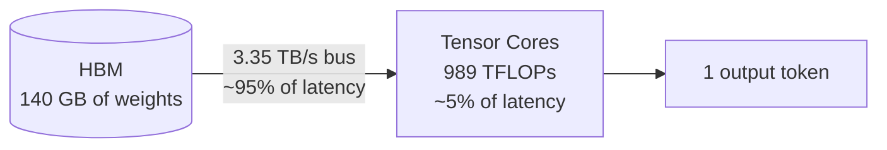

### 3.4 FlashAttention (preview of a future video)

- Standard attention repeatedly **round-trips large attention matrices to HBM**.
- **FlashAttention** splits the attention matrices into small **tiles that stay in SRAM (L1/shared memory)** and **fuses the calculations**, so the chip avoids extra trips back to the HBM warehouse.
- This works because L1/shared memory is **manually managed by the programmer**.

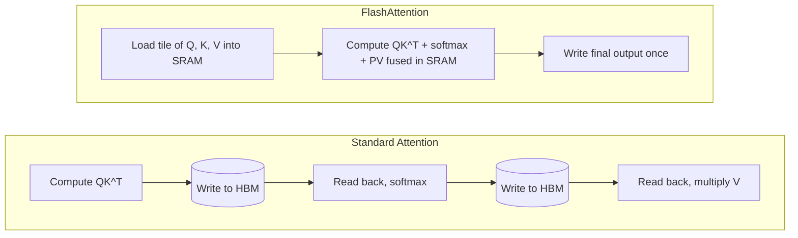

---

## 4. GPU Anatomy: Die, SMs, and Cores

### 4.1 Zoom levels


### 4.2 What's inside a Streaming Multiprocessor (SM)

An **SM is a mini-computer inside the GPU.** The H100 SXM has **132 active SMs** (the full GH100 die has 144).

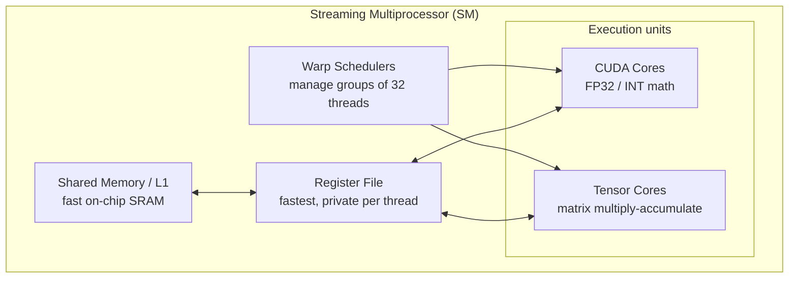

| SM component | Role |
|---|---|
| **CUDA cores** | Regular floating-point and integer math |
| **Tensor cores** | Specialized units for **matrix multiplication** |
| **Shared memory / L1 cache** | Fast on-chip SRAM for caching and data sharing |
| **Registers** | Fastest storage, **private to each thread** |
| **Warp schedulers** | Manage groups of **32 threads (warps)** |

### 4.3 Atomic-level view (from the video's zoom animation)

| Component | Function |
|---|---|
| **Register files** | High-speed local storage lanes feeding parameters immediately |
| **CUDA cores (FP32)** | Standard arithmetic pipelines for linear computations, pointers, loop control (e.g. `X * Y + Z`) |
| **Tensor core engine** | Specialized grids for multi-dimensional matrix dot-product transformations |

> Register files sit **physically adjacent** to the Tensor engine, so there is near-zero travel delay per cycle.

---

## 5. Warps, SIMD, and Warp Divergence

- The GPU executes code in **warps**: **groups of 32 threads** executing the **same instruction simultaneously**.
- This model is **SIMD** (Single Instruction, Multiple Data). NVIDIA calls it **SIMT**.

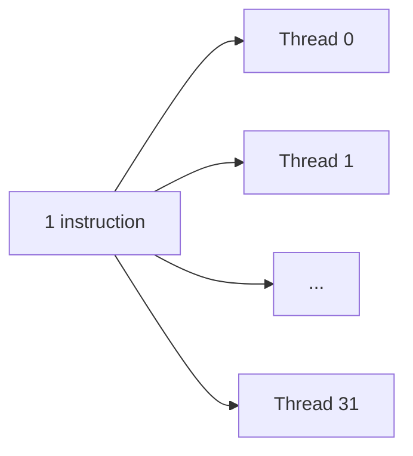

### Warp divergence

| Scenario | What happens | Result |
|---|---|---|
| All 32 threads take the **same** path | Fully parallel | Full speed |
| Threads take **different** `if/else` branches | The warp runs each branch **serially**, masking inactive threads | **Performance collapses** |

**Why neural-network code looks so uniform:** good GPU code keeps every thread in a warp doing *exactly the same thing*, and matrix math does this naturally.

---

## 6. Tensor Cores

### 6.1 CUDA cores vs tensor cores

| | CUDA core | Tensor core |
|---|---|---|
| Basic operation | Scalar multiply-add per clock | Whole small **matrix multiply-accumulate** per operation |
| Operation shown | `a * b + c` | `D = A x B + C` (4x4 matrices) |
| Work for a 4x4x4 tile | **64 sequential multiply-adds** | **1 fused operation** |
| Introduced | Original GPU design | **Volta (2017)**, built for deep learning |

```
Tensor core:   D = A x B + C      one fused matrix-FMA step
               [4x4] [4x4] [4x4]

CUDA cores:    64 separate scalar multiply-add operations (4x4x4 = 64)
               (each needs instruction fetch, decode, register traffic)
```

> Note: the video's narration says "32 multiply-adds", but a 4x4 by 4x4 multiply requires 4x4x4 = **64** FMAs. The video's own on-screen animation says 64. See [Corrections](#11-corrections-and-clarifications).

### 6.2 Generational improvement (FP16 tensor throughput)

| Generation | GPU | Peak FP16 tensor TFLOPs |
|---|---|---|
| Volta | V100 | **125** |
| Ampere | A100 | **312** |
| Hopper | H100 | **989** |
| Blackwell | B100 | **1,800+** (as quoted in the video) |

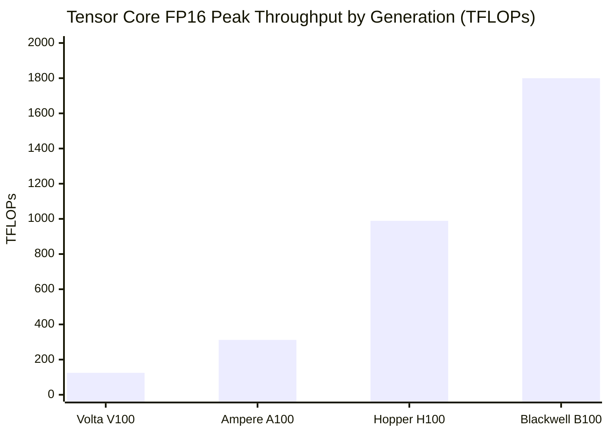

### 6.3 The catch: alignment

- Tensor cores only reach full speed when **matrix dimensions are multiples of 8 or 16**.
- Poorly shaped matrices **fall back to CUDA cores**, which is much slower.
- This is why **LLM implementations are careful about dimension choices** (hidden size, head dim, vocab padding).

---

## 7. Compute-Bound vs Memory-Bound (Roofline Model)

Every GPU operation is limited by one of two things:

| Type | Limited by | Symptom |
|---|---|---|
| **Compute-bound** | How fast the cores can do math | Tensor cores are busy, near peak FLOPs |
| **Memory-bandwidth-bound** | How fast data can be loaded from memory | Cores idle, waiting for data |

### 7.1 Key definitions

- **Arithmetic intensity** = FLOPs performed per byte moved from memory (**FLOP/Byte**).
- **Ridge point** = peak compute / memory bandwidth. It is the intensity at which you switch regimes.

### 7.2 Worked example: H100

```
Ridge point = Peak compute / Memory bandwidth
            = 989 TFLOPs/s / 3.35 TB/s
            ~= 295 FLOP/Byte
```

| Operation | Arithmetic intensity | Region |
|---|---|---|
| **Prefill** (large GEMM) | ~350 FLOP/Byte (from the simulation) | **Compute-bound** (above 295) |
| **Decode** (GEMV, batch ~1) | ~1 to 2 FLOP/Byte | **Massively memory-bound** (far below 295) |

> **Rule:** if your operation's arithmetic intensity is **below** the GPU's compute-to-bandwidth ratio, you are **memory-bound**.

### 7.3 Roofline diagram


## 8. LLM Inference: Prefill vs Decode

LLM inference has **two distinct phases** with opposite bottlenecks.

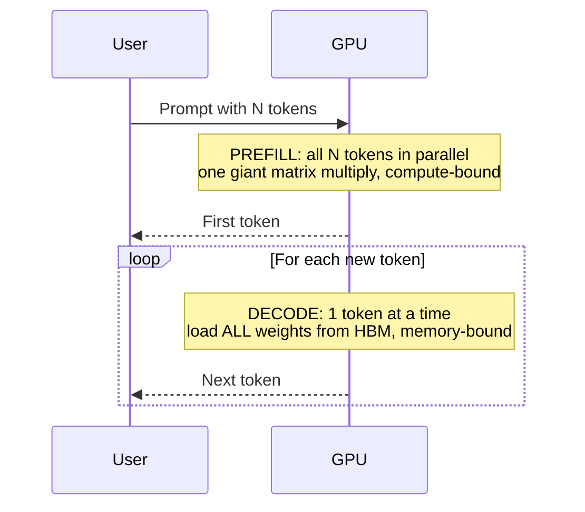

### 8.1 Side-by-side comparison

| Aspect | **Prefill** (prompt ingestion) | **Decode** (token generation) |
|---|---|---|
| What it does | Processes the entire prompt at once | Generates exactly one token per step |
| Parallelism | All prompt tokens simultaneously | Sequential, step by step |
| Matrix shape | Large, matrix x matrix (**GEMM**) | Tiny, matrix x vector (**GEMV**) |
| Arithmetic intensity | **High** (~350 FLOP/B) | **Low** (~1 to 2 FLOP/B) |
| Bottleneck | **Compute-bound** | **Memory-bandwidth-bound** |
| Tensor core utilization | Near 100% | Mostly idle |
| Weight reuse | High (weights reused across all tokens) | Virtually none (weights pulled from HBM every step) |
| Throughput | Close to GPU peak FLOPs | Limited by HBM bandwidth |

### 8.2 The decode speed limit (worked example)

**Setup:** 70B parameter model in FP16.

```
Model size        = 70 x 10^9 params x 2 bytes = 140 GB
Each token needs to read ALL weights from HBM once.

Time per token    = Model size / Memory bandwidth
Max tokens/sec    = Memory bandwidth / Model size
```

| GPU | HBM bandwidth | Time per token (140 GB) | Max decode speed (batch = 1) |
|---|---|---|---|
| A100 | 2.0 TB/s | 140 / 2000 = **70 ms** | **~14 tokens/s** |
| H100 | 3.35 TB/s | 140 / 3350 = **~42 ms** | **~24 tokens/s** |

> **The brutal truth:** it doesn't matter how many FLOPs your GPU has. If you're bandwidth-bound, more compute doesn't help. You're just waiting for data to arrive.

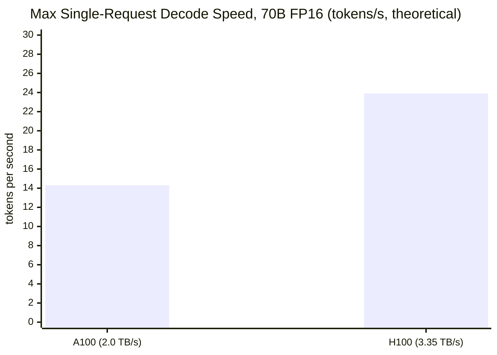

### 8.3 Effect of precision (quantization)

Fewer bytes per weight means less data to move, so decode gets faster.

| Precision | Bytes/param | 70B model size | Time/token on H100 | Max tokens/s (H100, batch 1) |
|---|---|---|---|---|
| FP16 | 2 | 140 GB | ~41.8 ms | ~24 |
| INT8 | 1 | 70 GB | ~20.9 ms | ~48 |
| INT4 / FP4 | 0.5 | 35 GB | ~10.4 ms | ~96 |

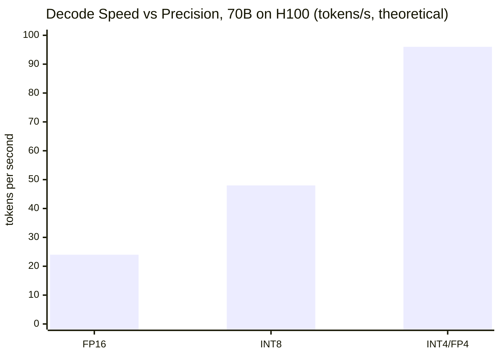

### 8.4 Why batching helps

- At batch = 1, you read 140 GB to produce **1 token**.
- With a batch of *B* requests, you read the **same 140 GB once** and produce **B tokens**. The load is **amortized across requests**.
- Arithmetic intensity grows roughly in proportion to batch size (about *B* FLOP/B in FP16), pushing decode toward the ridge point. *(This scaling is a standard extension, not stated in the video.)*

```
Batch = 1:    [140 GB read] -> 1 token        intensity ~ 1 FLOP/B
Batch = 64:   [140 GB read] -> 64 tokens      intensity ~ 64 FLOP/B
Batch ~ 300:  [140 GB read] -> ~300 tokens    intensity ~ ridge point (295)
```

---

## 9. Scaling Beyond One GPU

When a model is too big for one GPU's memory (a 70B FP16 model needs 140 GB, more than an 80 GB card), you must scale **across multiple devices**, and **how they talk to each other changes everything.**

### 9.1 Interconnects: NVLink vs PCIe

| Interconnect | Bandwidth | Role |
|---|---|---|
| **NVLink 4.0** (H100) | **900 GB/s** | Dedicated GPU-to-GPU fabric |
| **PCIe Gen 5** | **64 GB/s** | Standard slot; the "choke point" |
| Ratio | NVLink is **~14x faster** | Without NVLink, a cluster becomes a *data-routing traffic jam* |

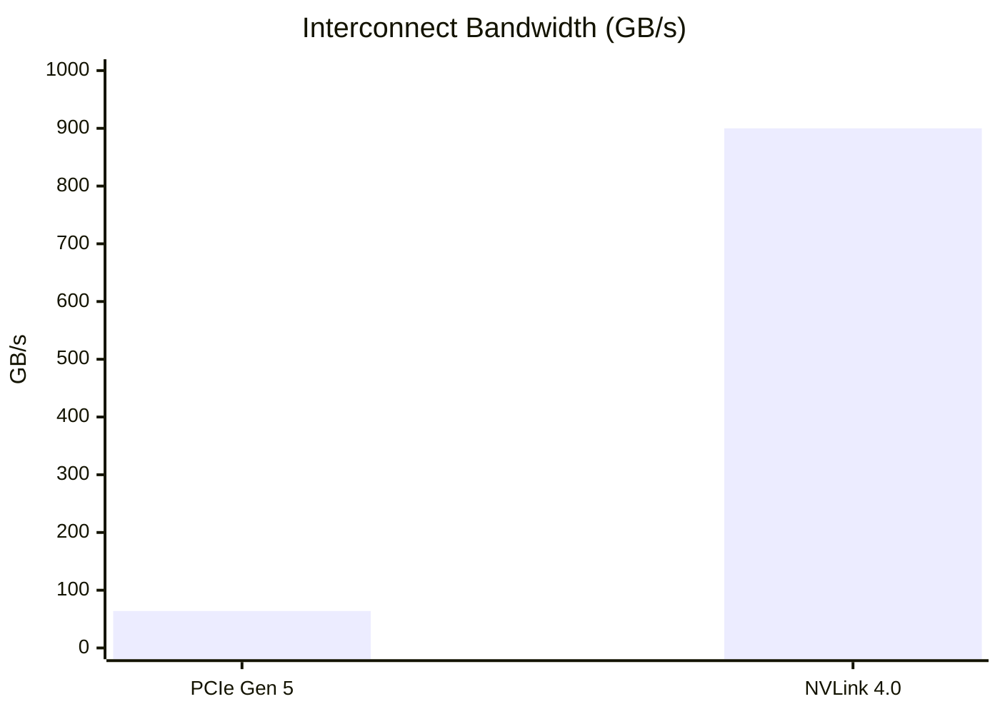

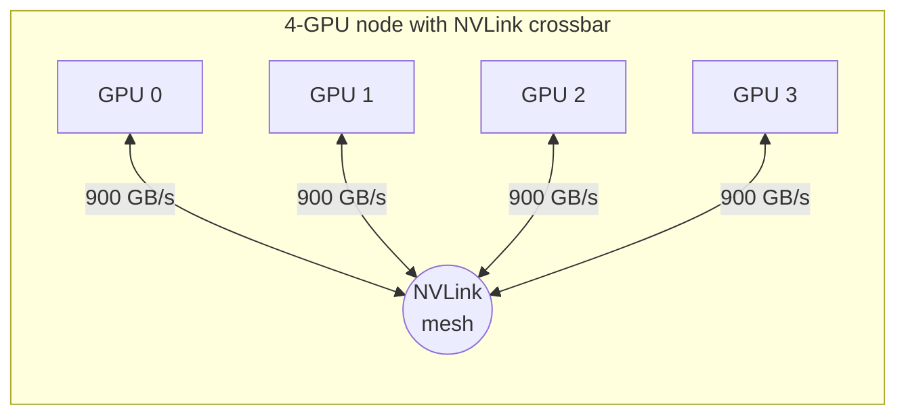

### 9.2 Three strategies

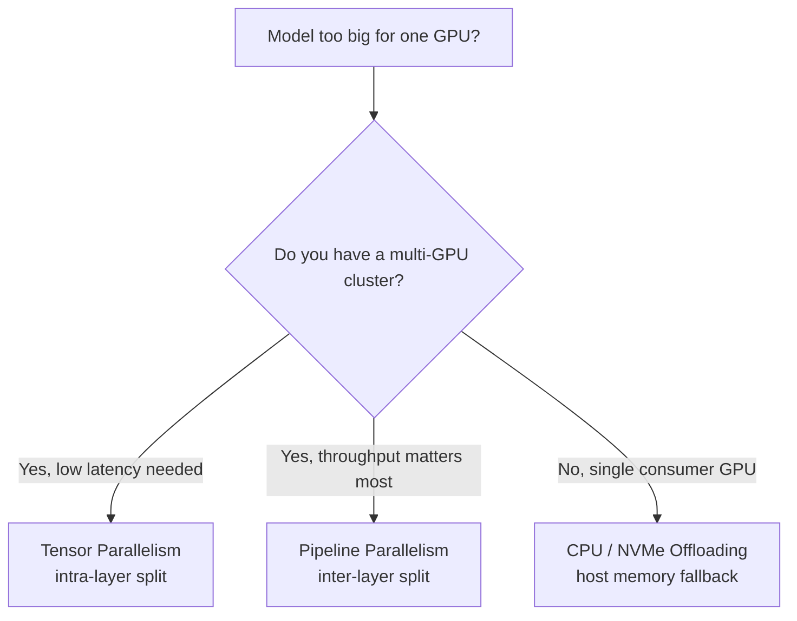

#### 9.2.1 Tensor Parallelism (intra-layer split)

- **Cuts individual weight matrices** (attention heads, feed-forward blocks) across GPUs, vertically or horizontally.
- **Every GPU holds a slice of every layer** and computes its fragment **at the same time**.
- After each layer's computation, GPUs must **synchronize via an all-reduce** to combine results.


| Pros | Cons |
|---|---|
| **Very low latency** | **Heavy communication overhead** (sync every layer) |
| Model memory divides across GPUs | Needs fast interconnect (NVLink) |
| Best for very large models (70B, 405B) where real-time generation is required | |

#### 9.2.2 Pipeline Parallelism (inter-layer split)

- Keeps each layer intact but **divides layers sequentially** across GPUs.
- Example: GPU 0 has layers 1 to 20, GPU 1 has layers 21 to 40, GPU 2 has layers 41 to 60, and so on.
- Data hands off only between **adjacent GPUs**, so communication is infrequent.
- **Downside: the pipeline bubble.** Downstream GPUs sit idle while upstream GPUs process the first token.

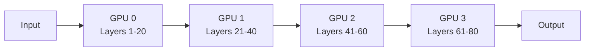

**Pipeline bubble (single request):**

```
Time ->      t1     t2     t3     t4
GPU 0      [ work ][ idle ][ idle ][ idle ]
GPU 1      [ idle ][ work ][ idle ][ idle ]
GPU 2      [ idle ][ idle ][ work ][ idle ]
GPU 3      [ idle ][ idle ][ idle ][ work ]
           ^ most GPUs idle = "bubble"
```

**With many micro-batches, the bubble shrinks:**

```
Time ->      t1   t2   t3   t4   t5   t6
GPU 0       [A ] [B ] [C ] [D ] .    .
GPU 1        .   [A ] [B ] [C ] [D ] .
GPU 2        .    .   [A ] [B ] [C ] [D ]
GPU 3        .    .    .  [A ] [B ] [C ] ...
```

| Pros | Cons |
|---|---|
| Low communication frequency | **Pipeline bubbles** (idle GPUs) |
| Highly efficient for **batch throughput** | **Poor single-user latency** |

#### 9.2.3 CPU / Host Memory Offloading

- Use case: **no multi-GPU cluster**, only a consumer card or workstation.
- Store weights in **system RAM** or on an **NVMe SSD** instead of VRAM.
- The engine **streams weights into the GPU just in time**, computes, then **discards them** to make room for the next block.
- **Slow**, limited by the **PCIe bottleneck (64 GB/s)** and worse for SSD. But it **democratizes AI**: this is what lets engines like **llama.cpp** run huge models on laptops and desktops.

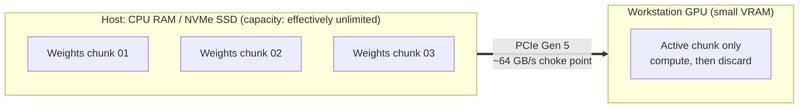

### 9.3 Comparison table

| | **Tensor Parallelism** | **Pipeline Parallelism** | **Host Offloading** |
|---|---|---|---|
| Split type | **Intra-layer** (inside each layer) | **Inter-layer** (between layers) | Weights off the GPU |
| What each GPU holds | A slice of **every** layer | A **contiguous group** of layers | A small **active chunk** |
| Communication | All-reduce **every layer** | Handoff between **adjacent GPUs** | Streaming over **PCIe** |
| Communication frequency | Very high | Low | Constant streaming |
| Interconnect need | **NVLink strongly needed** | Moderate | PCIe (or NVMe) |
| Latency | **Very low** | High for a single user | **Slowest** |
| Throughput | Good | **Excellent for batches** | Low |
| Main weakness | Sync overhead | **Pipeline bubble** | PCIe bottleneck |
| Best for | Huge models, real-time serving | Batch/offline throughput | Local, consumer hardware |

---

## 10. Optimization Techniques That Fight the Memory Wall

| Technique | Problem it attacks | How it helps |
|---|---|---|
| **Quantization** (INT8/FP4) | Too many bytes to move | Shrinks weight size, so more fits over the narrow bus |
| **Batching** | 140 GB load for just 1 token | Amortizes weight loading across many requests |
| **Speculative decoding** | One token per weight load | Processes multiple candidate tokens per weight pass |
| **KV caching** | Redundant recomputation of context | Avoids refetching/recomputing past context |
| **FlashAttention** | Attention matrices round-tripping to HBM | Keeps tiles in SRAM and fuses operations |
| **Tensor parallelism** | Single-GPU VRAM/bandwidth caps | Splits weights across GPUs (over NVLink) |

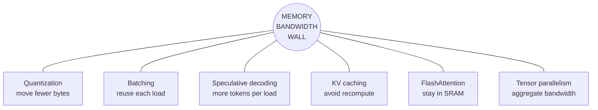

## 11. Corrections and Clarifications

Some points in the video (narration or visuals) are slightly off or simplified. Useful to know when studying:

| Topic | In the video | More accurate |
|---|---|---|
| **Tensor core 4x4 MMA** | "32 multiply-adds" (narration) | A 4x4 by 4x4 multiply-accumulate is 4x4x4 = **64** FMAs. The on-screen "64 sequential loops" is correct. Real hardware also operates on larger tiles at the warp level; 4x4 is a conceptual simplification. |
| **Shared memory per SM** | ~256 KB (narration), 128 KB (zoom animation) | H100 has up to **256 KB combined L1/shared memory per SM**. The 128 KB in the animation is a simplification. |
| **SM count** | 132 (narration), 144 (animation) | The **full GH100 die has 144 SMs**; the shipping **H100 SXM enables 132**. |
| **Pipeline parallelism example** | "GPU 2 handles layers 1-20, GPU 1 handles 21-40" | GPU numbering should be sequential: **GPU 0 = layers 1-20, GPU 1 = 21-40**. |
| **Decode arithmetic intensity** | ~2 FLOP/B | For FP16 (2 bytes/param, ~2 FLOPs/param) it is closer to **~1 FLOP/B**. Either way it is far below the ~295 ridge point, so the conclusion is unchanged. |
| **14 tokens/s figure** | Max decode speed for a 70B FP16 model | Fine as a theoretical single-GPU bound, but a 70B FP16 model (140 GB) **does not fit on one 80 GB A100**. In practice you need multiple GPUs or quantization. |
| **Peak TFLOPs figures** | 989 TFLOPs (H100) | This is **dense FP16/BF16** tensor throughput (sparse figures are 2x). The "B100 1,800+" figure is quoted from the video. |

## 12. Cheat Sheet and Recap

### 12.1 Key numbers

| Quantity | Value |
|---|---|
| CPU cores | 8 to 64 |
| H100 CUDA cores | 16,896 |
| H100 SMs | 132 (144 on full die) |
| Warp size | 32 threads |
| HBM capacity | 40 to 80 GB (A100), up to 141 GB (H100) |
| HBM bandwidth | 2.0 to 3.35 TB/s |
| L2 cache | 50 to 100 MB, ~12 to 14 TB/s |
| L1/shared memory | ~256 KB per SM, ~33+ TB/s |
| H100 FP16 tensor peak | 989 TFLOPs |
| H100 ridge point | ~295 FLOP/Byte |
| NVLink 4.0 vs PCIe Gen 5 | 900 GB/s vs 64 GB/s (~14x) |
| 70B FP16 model size | ~140 GB |
| A100 max decode (70B FP16) | ~14 tokens/s |

### 12.2 Memory hierarchy at a glance

| Level | Size | Speed | Managed by |
|---|---|---|---|
| HBM | Biggest | Slowest | System |
| L2 | Medium | Faster | Hardware |
| L1/SRAM | Small | Very fast | **Programmer** |
| Registers | Tiny | Fastest | Compiler |

### 12.3 Core formulas

```
Ridge point (FLOP/B)     = Peak FLOPs / Memory bandwidth
Model size (bytes)       = Parameters x Bytes per parameter
Time per token (decode)  ~= Model size / Memory bandwidth
Max tokens/sec (batch 1) ~= Memory bandwidth / Model size
Arithmetic intensity     = FLOPs performed / Bytes moved
```

### 12.4 Final recap

1. **GPUs beat CPUs for AI** because neural networks are *embarrassingly parallel matrix multiplications*.
2. **SMs and tensor cores** execute these operations in bulk: warps of 32 threads, matrix multiply-accumulate in a single fused operation.
3. The **real bottleneck in LLM inference is memory bandwidth**, especially during **decode**.
4. **Prefill is compute-bound; decode is memory-bound.**
5. **Multi-GPU scaling** (tensor parallelism, pipeline parallelism, offloading) depends critically on **interconnect speed**: NVLink >> PCIe.
6. **Every optimization in the playlist**, including quantization, batching, speculative decoding, KV caching, and FlashAttention, is fighting the **memory bandwidth wall**.

> **Next in the series:** attention mechanisms, and the different ways engineers have tried to make the memory bottleneck smaller.
