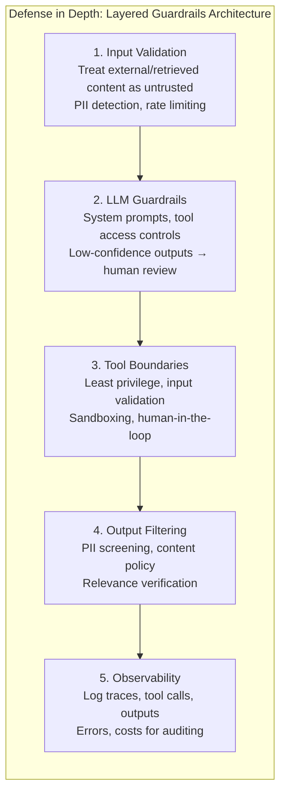
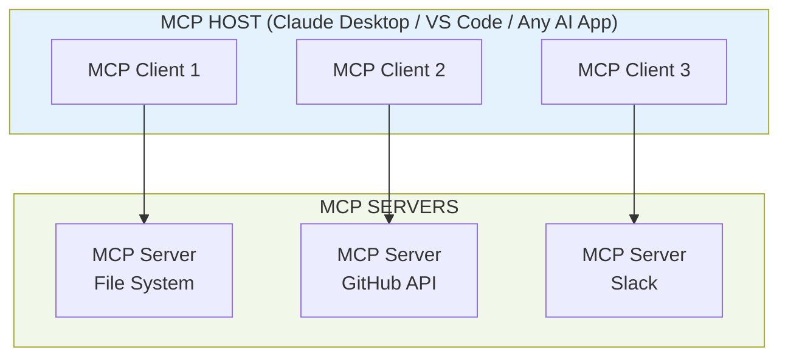
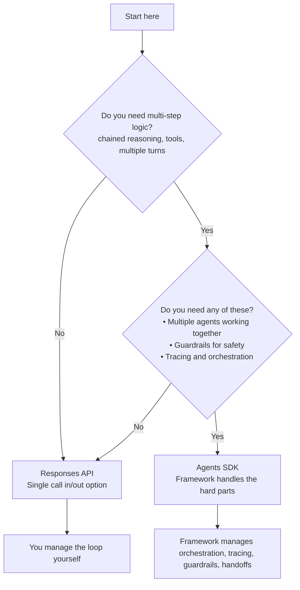
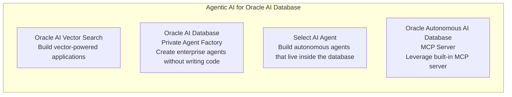

# Oracle Agentic AI Foundations Course
## Comprehensive Detailed Study Notes

**Course Type:** Free Oracle University Course (with free certification)  
**Focus:** From fundamentals of AI Agents to production deployment on OCI Enterprise AI Platform and Oracle AI Database  
**Approach:** First principles + hands-on building (LangChain, OpenAI Stack, MCP, OCI)  
**Target Skill Level:** Beginners to intermediate practitioners in agentic AI  

---

## Table of Contents

1. [Course Introduction & Why Agentic AI Matters](#1-course-introduction--why-agentic-ai-matters)
2. [Who Should Take This Course](#2-who-should-take-this-course)
3. [Prerequisites](#3-prerequisites)
4. [Learning Outcomes](#4-learning-outcomes)
5. [Module 1: Introduction to AI Agents](#5-module-1-introduction-to-ai-agents)
6. [Module 2: LangChain for AI Agents](#6-module-2-langchain-for-ai-agents)
7. [Module 3: Introduction to MCP (Model Context Protocol)](#7-module-3-introduction-to-mcp-model-context-protocol)
8. [Module 4: OpenAI Responses API and Agents SDK](#8-module-4-openai-responses-api-and-agents-sdk)
9. [Module 5: Agentic AI for Enterprises (OCI)](#9-module-5-agentic-ai-for-enterprises-oci)
10. [Module 6: Agentic AI for Oracle AI Database](#10-module-6-agentic-ai-for-oracle-ai-database)
11. [Certification & Exam Preparation](#11-certification--exam-preparation)
12. [Success Tips & Final Summary](#12-success-tips--final-summary)

---

## 1. Course Introduction & Why Agentic AI Matters

### The Big Shift in AI

Two years ago, the breakthrough was **AI that could answer almost anything**.

Today, the breakthrough is **AI that can actually do things for you** — take a goal and go accomplish it.

This is the core idea behind **Agentic AI**.

An agent doesn't just generate text in response to a prompt. It:
- Understands a high-level goal
- Breaks it down
- Uses tools
- Observes results
- Iterates until the goal is achieved (or a stopping condition is met)

### Why This Specific Course?

There are hundreds of AI/agent courses available. This one stands out for two deliberate reasons:

1. **It covers the absolute basics** — If you are new to agentic AI, you will learn a tremendous amount without feeling lost.
2. **It teaches from first principles** — You will not only learn *how* something works, but *why* it works that way. The "why" is what makes advanced topics click later.

The course walks you through building several agents from scratch, using:
- LangChain
- OpenAI Agents SDK / Responses API
- A real MCP server
- Production patterns on **OCI Enterprise AI Platform**
- Capabilities inside **Oracle AI Database**

By the end, you will have practical experience across the full spectrum — from local prototyping to enterprise deployment.

---

## 2. Who Should Take This Course?

The course is intentionally designed to be accessible to multiple roles. The visual design shows four distinct personas connected by dashed lines, emphasizing that the content bridges different backgrounds.

| Persona                  | Profile                                                                 | Why This Course Fits                                                                 |
|--------------------------|-------------------------------------------------------------------------|--------------------------------------------------------------------------------------|
| **Agentic AI Beginners** | Completely new to the idea of AI agents                                 | Starts from zero. Defines what an agent is, why the loop matters, and builds first agent step-by-step |
| **AI/ML Engineers**      | Experienced with models, fine-tuning, or ML pipelines                   | Moves from model-centric thinking to agent-centric architectures (tools, loops, orchestration, guardrails) |
| **Data Scientists**      | Strong in data analysis, experimentation, and Python                    | Learns how agents ground on data (vector search), use tools, and how Oracle AI Database enables agentic workflows |
| **Cloud Developers**     | Comfortable with cloud services, APIs, deployment, and infrastructure   | Focuses on OCI Enterprise AI runtime, scaling, security, observability, and MCP integration with Oracle services |

**Key Message from Course:** Even if you are brand new to agentic AI, you are explicitly welcome. The course starts from fundamentals and never assumes prior agent-building experience.

---

## 3. Prerequisites

The course has three clear prerequisites. These are not overly heavy but are important for smooth progress.

| Prerequisite | What It Means in Practice | Why It Matters in This Course |
|--------------|---------------------------|-------------------------------|
| **Basic familiarity with LLM concepts** | You understand prompts, completions, tokens, temperature, top-p, system vs user messages, and basic prompt engineering | All agent frameworks build on top of LLM calls. You need to know what the "brain" is doing |
| **Working knowledge of Python** | Comfortable writing functions, using libraries, basic error handling, virtual environments, and running scripts | You will write agent code, tool functions, MCP servers, and interact with SDKs |
| **Basic familiarity with Oracle Cloud Infrastructure (OCI)** | Can navigate the console, understand compartments, create basic resources, and know where to find documentation | Later modules involve OCI Enterprise AI Platform, Autonomous Database, logging, monitoring, and integrations |

**Recommendation:** If you are weak in any area, spend 1–2 hours refreshing before starting the hands-on parts. The course moves at a steady pace once building begins.

---

## 4. Learning Outcomes

By the end of the course you will be able to:

1. **Understand core AI Agent concepts**  
   Clearly articulate what an agent is, why the observe-reason-act loop is powerful, the role of reasoning patterns (CoT, ReAct), and why safety guardrails must be layered.

2. **Design AI Agents using LangChain and the OpenAI Agent Stack**  
   Build agents with LangChain (LCEL, chains, tools), understand what frameworks hide, choose between OpenAI Responses API and Agents SDK, implement tools/function calling, multi-agent handoffs, and guardrails.

3. **Implement Model Context Protocol (MCP) concepts**  
   Explain MCP architecture (Host → Clients → Servers), add an MCP server to an agent, understand JSON-RPC communication, and differentiate local tool servers from enterprise remote servers (with real Oracle usage example).

4. **Build Agents using the OCI Enterprise AI Platform**  
   Understand why production agents need a managed lifecycle and runtime, use OCI’s building blocks (hosted endpoints, sandboxed tools, memory, observability), and deploy/scale agents properly.

5. **Apply Oracle AI Database capabilities for agentic AI**  
   Use AI Vector Search for grounding, create agents via Private Agent Factory, work with Select AI Agent, and expose database capabilities through the built-in Autonomous AI Database MCP Server.

These outcomes are deliberately progressive: fundamentals → frameworks → protocol standardization → enterprise runtime → database-native agentic features.

---

## 5. Module 1: Introduction to AI Agents

### 5.1 What is an AI Agent?

An **AI Agent** is a system that uses a Large Language Model as its reasoning engine, combined with tools and an iterative loop, to autonomously work toward a goal.

**Simple but powerful definition from course:**
> AI that can take a goal and go accomplish it.

This is the fundamental shift from "generative AI" (produce text/image) to "agentic AI" (pursue objectives through actions and iteration).

### 5.2 Core Components – LLM + Tools + Loop

The slide gives the clean formula:

**AI Agent (LLM-based) = LLM + Tools + Loop**

| Component | Role | Real-World Analogy |
|-----------|------|--------------------|
| **LLM**   | The brain — performs reasoning, planning, decision making, and natural language understanding/generation | The strategist who thinks through the problem |
| **Tools** | External capabilities the agent can invoke (web search, calculators, APIs, code execution, databases, email, etc.) | The hands and senses — ways to interact with the world |
| **Loop**  | Iterative cycle: Observe → Reason → Act → Observe again | The process of trying, learning from results, and continuing until done |

**Four Key Characteristics of Agents (from slide):**

- **Goal-Directed**: Works toward an objective rather than just responding to the last prompt.
- **Autonomous**: Decides the next step itself instead of being told every action.
- **Tool-Using**: Actively calls external functions/APIs/databases/code interpreters.
- **Iterative**: Runs in a continuous Observe → Reason → Act loop until the goal is satisfied or a limit is reached.

### 5.3 Reasoning Patterns – CoT and ReAct

The module introduces two foundational reasoning patterns:

- **Chain of Thought (CoT)**: The model is prompted to show its step-by-step reasoning before giving a final answer. This dramatically improves performance on multi-step arithmetic, logic, and planning tasks.
- **ReAct (Reason + Act)**: Combines explicit reasoning traces with tool-using actions in a loop. The agent literally writes "I need to search for X because..." then calls a tool, observes the result, reasons again, and repeats. This is the dominant pattern for tool-augmented agents.

These patterns are not just prompt tricks — they are the cognitive scaffolding that makes reliable agent behavior possible.

### 5.4 Your First AI Agent Walkthrough

This is the hands-on heart of Module 1. You will:
- Define a simple goal
- Give the agent access to one or two tools
- Run the observe-reason-act loop
- See the agent succeed (or fail and recover)

The goal is to make the abstract formula concrete: you will literally watch the LLM reason, call a tool, receive an observation, and continue.

### 5.5 Safety and Guardrails – Defense in Depth

Because agents can take real actions (and potentially cause harm or cost money), safety cannot be an afterthought. The course presents a **Layered Guardrails Architecture** with five distinct layers.

**Defense in Depth – 5 Layers:**



**Why five layers?** If any single layer fails, the others still provide protection. This is the same philosophy used in secure system design (defense in depth).

**Practical Implication:** In later modules you will see how LangChain, OpenAI SDK, MCP, and OCI each implement pieces of these guardrails.

**Module 1 Key Takeaway:**  
An agent is not just "LLM + prompt". It is a system with components, reasoning patterns, an execution loop, and multiple layers of safety. Understanding this mental model is the foundation for everything that follows.

---

## 6. Module 2: LangChain for AI Agents

### 6.1 Introduction to LangChain

LangChain is one of the most widely used frameworks for building LLM applications and agents. It provides abstractions that make it easier to:
- Compose prompts, models, and parsers
- Manage conversation history
- Integrate tools
- Build and orchestrate agents

### 6.2 Chains — Connecting the Pieces

The core abstraction in LangChain is the **Chain** — a sequence of steps that data flows through.

Typical simple chain (from slide):

```
Prompt Template → LLM Model → Output Parser → Final Result
```

### 6.3 LangChain Expression Language (LCEL)

LCEL is the modern, declarative way to build chains using the pipe operator `|`.

**Example from course slide:**

```python
from langchain_core.output_parsers import StrOutputParser
from langchain_core.prompts import ChatPromptTemplate

prompt = ChatPromptTemplate.from_template("{topic}")

chain = prompt | model | StrOutputParser()

result = chain.invoke({"topic": "AI agents"})
print(result)
```

This syntax is clean, readable, and composable. You can add more steps (retrievers, tools, memory, etc.) by simply adding more `|` segments.

### 6.4 LangChain Agent Under the Hood

One of the most valuable parts of this module is the "what LangChain hides from you" explanation.

When you write:

```python
agent = create_agent(model=model, tools=tools, ...)
result = agent.invoke({"messages": [{"role": "user", "content": "question"}]})
```

A surprising amount of machinery runs behind the scenes.

**What LangChain Does For You Automatically:**

- Builds tool schemas from `@tool` decorated Python functions
- Formats messages into the exact JSON structure the model API expects
- Parses tool call responses that come back as JSON
- Maintains an internal registry of available tools
- Executes the correct Python function with properly parsed arguments
- Appends tool results back into the conversation history
- Decides whether another LLM call is needed (loop control)
- Assembles and returns the final structured result

**Why Understanding This Matters:**

| Benefit | Explanation |
|---------|-------------|
| **Debugging** | When an agent fails, you know whether the problem is in prompting, tool definition, parsing, or loop logic |
| **Customization** | You can build custom agent loops when the default behavior isn't enough |
| **Performance** | You can optimize (caching, parallel tool calls, prompt compression) |
| **Production** | You understand what needs monitoring and where failures can occur |

**Module 2 Key Takeaway:**  
LangChain (and similar frameworks) dramatically accelerate development by hiding boilerplate. However, to build reliable agents and debug them in production, you must understand what is happening under the hood.

---

## 7. Module 3: Introduction to MCP (Model Context Protocol)

### 7.1 What is Model Context Protocol (MCP)?

MCP is an open protocol that standardizes how AI applications (hosts) discover and interact with external **tools, resources, and prompts** provided by **MCP Servers**.

Think of it as a universal plugin system for agents. Instead of every framework having its own way of connecting to tools and data, MCP provides a consistent client-server contract.

### 7.2 Core Components

| Component     | Description | Examples |
|---------------|-------------|----------|
| **MCP Host**  | The AI application that creates clients and manages the overall experience | Claude Desktop, VS Code with MCP extension, custom agent runtime |
| **MCP Client**| Lightweight connector (one per server). Handles communication using JSON-RPC 2.0 | Created automatically by the host |
| **MCP Server**| Exposes Tools, Resources, and Prompts. Can run locally (stdio) or remotely (HTTPS) | File System server, GitHub server, Slack server, Math server, Oracle Usage server |

### 7.3 MCP Architecture



**Key Architectural Points (from slide):**

- Host manages the AI app and creates clients.
- Each client connects to **exactly one** server.
- Servers expose tools, data (resources), and prompts.
- Communication protocol is **JSON-RPC 2.0**.
- Servers can run **locally** (same machine, stdio transport) or **remotely** (over network).

### 7.4 Adding an MCP Server to Your Agent

In this module you will:
1. Run or connect to an MCP server (starting with a simple local one).
2. Register it with your agent (via host or SDK).
3. See the agent discover and use the new tools/resources automatically.

This is a powerful pattern because it decouples tool development from agent development.

### 7.5 Real-World MCP Walkthrough: Math Server vs Oracle Usage Server

The course shows two concrete MCP servers to illustrate the uniformity of the interface versus the diversity of backends.

**Comparison Table:**

| Aspect                    | MCP Math Server (You wrote it)          | Oracle Usage MCP Server (Oracle)              |
|---------------------------|-----------------------------------------|-----------------------------------------------|
| **Client code shape**     | Same (you write similar client code)    | Same                                          |
| **Protocol**              | JSON-RPC 2.0                            | JSON-RPC 2.0                                  |
| **Transport**             | stdio (local Python process)            | HTTPS + OCI SDK                               |
| **Tools exposed**         | add(), subtract(), multiply()           | RequestSummarizedUsages()                     |
| **Where it runs**         | Your laptop                             | Oracle Cloud (remote)                         |
| **Purpose**               | Teaching/demo of local tools            | Real enterprise cloud cost/usage data         |

**The Profound Lesson:**

The agent (and you, the developer) interact with both servers using the **exact same MCP interface**. The complexity of talking to Oracle Cloud is hidden behind the MCP server abstraction, just like a simple local math function.

This is the power of MCP: it creates a **uniform contract** across wildly different backends.

**Module 3 Key Takeaway:**  
MCP brings standardization and interoperability to the agent tooling ecosystem. Once you understand the Host-Client-Server model and JSON-RPC contract, you can connect almost any capability to your agents in a consistent way — whether it's a local Python function or an enterprise Oracle Cloud API.

---

## 8. Module 4: OpenAI Responses API and Agents SDK

### 8.1 OpenAI Agent Stack Overview

OpenAI provides two main ways to build agents:

- **Responses API** — Lower-level, simpler. You send a single call (or manage the loop yourself) and get back structured output or tool calls.
- **Agents SDK** — Higher-level framework. It handles orchestration, tracing, guardrails, multi-agent handoffs, and state management for you.

### 8.2 Choosing Between Responses API and Agents SDK

The course provides an excellent decision flowchart (recreated below):



**Rule of Thumb:**
- Simple single-turn or you-want-full-control → Responses API
- Complex, multi-agent, production safety/tracing needs → Agents SDK

### 8.3 Tools and Function Calling

Both approaches support **tools** (function calling). You define Python functions, decorate them or describe them in a schema, and the model decides when to call them. The framework/SDK handles the parsing and execution loop.

### 8.4 Multi-Agent Systems and Handoffs

Real-world problems are often too broad for a single agent. The solution is **specialized agents** that hand off to each other.

**Example Project in Course: Customer Support Agent System**

```
User Request
     ↓
Triage Agent (routes the request)
     ↓
    ├→ Order Status Agent
    ├→ Refunds Agent
    └→ FAQ Agent
```

Each specialized agent has its own instructions, tools, and guardrails. The Triage Agent's job is to understand intent and route correctly.

### 8.5 OpenAI Guardrails and Safety

The Agents SDK includes built-in support for guardrails (input/output filtering, safety prompts, human-in-the-loop hooks, etc.). This directly maps to the 5-layer defense model from Module 1.

### 8.6 Putting It All Together

By the end of Module 4 you will have built a multi-agent customer support system that demonstrates:
- Tool use
- Agent specialization
- Handoffs between agents
- Guardrails
- Observability/tracing

This is the closest thing to a "production pattern" you will see in the OpenAI portion of the course.

**Module 4 Key Takeaway:**  
OpenAI gives you two complementary tools. The Responses API is lightweight and flexible. The Agents SDK is opinionated and powerful for complex, multi-agent, safety-critical systems. Knowing when to use each (and how to combine them) is a valuable skill.

---

## 9. Module 5: Agentic AI for Enterprises (OCI Enterprise AI Platform)

### 9.1 Why Enterprises Need More Than Local Agents

A LangChain or OpenAI agent running on your laptop is great for prototyping. It is **not** sufficient for production enterprise use because it lacks:

- Managed hosting and auto-scaling
- Persistent memory and session handling
- Enterprise security, sandboxing, and audit
- Deep integration with company data and services
- Observability, monitoring, and cost control at scale

This is why Oracle (and other cloud providers) offer managed **Agent Runtime** platforms.

### 9.2 OCI Enterprise AI Agents — Lifecycle + Runtime

The key diagram in this module shows the separation of concerns:

```mermaid
graph TD
    UserApp["Your User / App"] --> OCI["Managed by OCI<br/>Agent Runtime / Orchestration / Management"]
    
    OCI -->|Hosted endpoints<br/>Auto scaling<br/>Memory & sessions<br/>Sandboxed tools<br/>Logging & Audit (OCI)<br/>Integrations| YourLogic["Your Agent Logic<br/>(this is all you write)"]
    
    style OCI fill:#e3f2fd,stroke:#1565c0
    style YourLogic fill:#fff8e1,stroke:#f57c00
```

**What You Focus On (Your Responsibilities):**

- Agent instructions and persona
- Which tools it can call
- Which knowledge bases it should ground on
- The business outcome the agent drives

**What OCI Handles For You:**

- Hosted endpoints (no servers to manage)
- Automatic scaling
- Memory and sessions (built into Conversations API)
- Sandboxed tool execution (Code Interpreter, containers)
- Full observability (Logging, Monitoring, Audit)
- Integrations with OCI data services and enterprise systems

### 9.3 Getting Started and Deploying at Scale

Module 5 walks you through:
- Creating your first OCI Enterprise AI Agent
- Configuring tools and knowledge bases
- Deploying to hosted endpoints
- Monitoring and scaling

This is where the course transitions from "I built an agent on my laptop" to "I have a production-grade agent running in the cloud with enterprise controls."

**Module 5 Key Takeaway:**  
Enterprise agentic AI requires a proper runtime and lifecycle platform. OCI Enterprise AI Platform abstracts away infrastructure concerns so you can focus on agent intelligence and business logic while still getting security, scale, and observability out of the box.

---

## 10. Module 6: Agentic AI for Oracle AI Database

### 10.1 The Convergence of Agents and Data

The final module shows how Oracle is embedding agentic capabilities directly into its database layer. This is significant because most enterprise data lives in databases, and moving it out for agents creates security, latency, and governance issues.

### 10.2 The Four Pillars of Agentic AI in Oracle AI Database



| Pillar | What It Enables | Key Benefit |
|--------|------------------|-------------|
| **Oracle AI Vector Search** | Store and search embeddings at scale inside the database | Fast, secure RAG and semantic grounding for agents without exporting data |
| **Private Agent Factory** | Low-code / no-code creation of enterprise agents | Accelerates development while staying inside governed database environment |
| **Select AI Agent** | Natural language → SQL / actions executed inside the database | Autonomous agents that understand and act on your enterprise data directly |
| **Autonomous AI Database MCP Server** | Expose database tools, data, and prompts via standard MCP protocol | Any MCP-compatible host (Claude, custom agents, etc.) can securely use the database as a tool provider |

**Underlying Technology Highlights (from slide):**
- Oracle Deep Data Security
- Oracle Trusted Answer Search
- Oracle Vectors on Ice (performance)
- Oracle Private AI Services Container

### 10.3 Why This Matters

For organizations already invested in Oracle databases, this module shows a path to agentic AI that:
- Keeps data in place (data gravity)
- Leverages existing security and governance
- Uses familiar Oracle tooling and skills
- Exposes capabilities through open standards (MCP)

**Module 6 Key Takeaway:**  
The database is becoming an active participant in agentic systems, not just a passive data store. Oracle AI Database brings vector search, agent factories, natural-language agents, and MCP exposure together in one governed platform.

---

## 11. Certification & Exam Preparation

This course prepares you for an **Oracle certification** that is **always free**.

**Official Success Recommendations (from instructor):**

1. **Build a study plan** — Schedule consistent time rather than binge-watching.
2. **Leverage AI-generated notes** — Summarize concepts in your own words (these notes are an example of that approach).
3. **Practice in an actual OCI account** — Theory is good; hands-on in the console and with code is better.
4. **Complete every skill check** inside the course modules.
5. **Review all exam prep material** provided by Oracle.
6. **Take the free practice exam** before attempting the real certification exam.

Passing the certification gives you formal recognition of your agentic AI knowledge on the Oracle stack.

---

## 12. Success Tips & Final Summary

### Instructor's Final Advice

- Be excited — agentic AI is one of the most important shifts in technology right now.
- Build as you learn. Watching alone is not enough.
- Focus on the **why** behind every pattern (CoT, ReAct, MCP architecture, layered guardrails, OCI runtime). The why travels with you to new frameworks and platforms.
- Use the course's hands-on labs and the free OCI tier generously.

### Cross-Module Themes Summary

| Theme                    | Primary Modules | Core Idea |
|--------------------------|-----------------|-----------|
| **Fundamentals**         | M1              | Agent = LLM + Tools + Loop + Reasoning + Layered Safety |
| **Developer Frameworks** | M2, M3, M4      | LangChain abstractions, MCP standardization, OpenAI Responses vs SDK choice |
| **Enterprise Runtime**   | M5              | Managed lifecycle, scaling, security, and observability on OCI |
| **Data-Native Agents**   | M6              | Vector search, private agent factory, Select AI, and MCP server inside Oracle AI Database |

### Closing Thought

The course moves you from understanding what an agent *is* to confidently building, securing, deploying, and scaling agents — both with open frameworks and on Oracle's enterprise platform.

Whether your goal is to prototype locally, pass the free certification, or deploy production agents that interact with real enterprise data and systems, this course provides a coherent, first-principles path.

---

**Document Information**  
- **Created from:** Official course introduction video transcript + all module overview slides (M1–M6)  
- **Purpose:** Detailed study notes for learning, review, and certification preparation  
- **Style:** Grounded explanations, tables for comparison, Mermaid diagrams for architectures and flows  
- **Recommendation:** Read one module section, then immediately do the corresponding hands-on lab

**End of Notes**

*These notes are designed to be used alongside the actual Oracle course videos and labs for maximum retention and practical skill development.*
