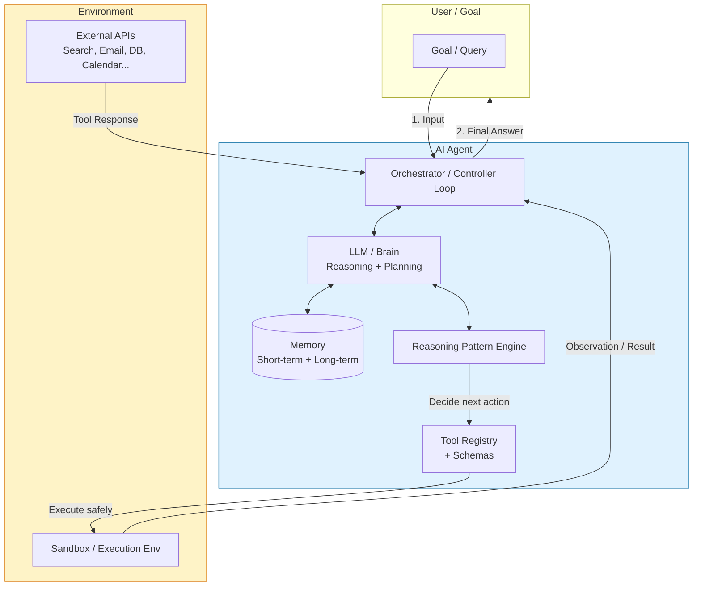
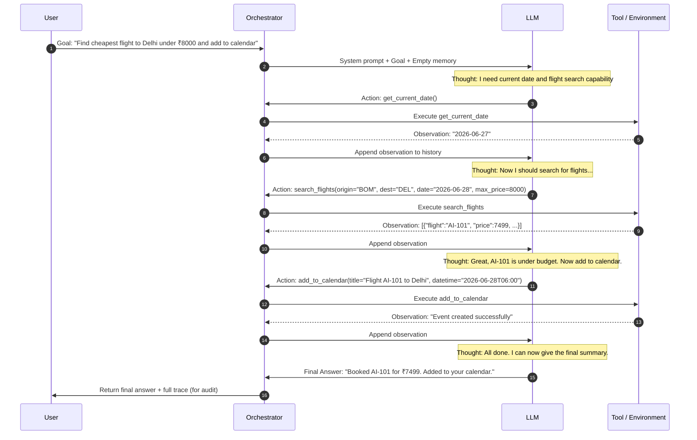

# Introduction to AI Agents
## Comprehensive Module Notes

**Module Theme:** Concepts → Components → Patterns → Code → Safety  
**Target Audience:** Learners with basic Python familiarity who want to move from using LLMs to building autonomous, tool-using AI systems.  
**Module Goal:** Understand what agents are, how they work internally, implement a working agent from scratch, and apply safety practices before deploying anything to production.

---

## Agenda Overview

This module follows a deliberate pedagogical path. We do **not** jump straight to code. We build intuition layer by layer.

| # | Topic                        | What You Will Learn                                      | Why It Matters |
|---|------------------------------|----------------------------------------------------------|---------------|
| 1 | What is an AI Agent?         | Precise definition, evolution from chatbots, key characteristics | Avoids the common confusion between "LLM wrapper" and true agent |
| 2 | AI Agent Core Components     | The five essential building blocks and how they interact | Gives you a mental model to debug and extend any agent framework |
| 3 | Reasoning Patterns           | CoT, ReAct, Plan-and-Execute, Reflexion and when to use each | The "secret sauce" that makes agents reliable instead of brittle |
| 4 | Building your first AI Agent | Complete, minimal, production-style Python implementation using native tool calling | Turns theory into muscle memory; you leave with runnable code |
| 5 | Safety & Guardrails          | Real risks, guardrail patterns, human-in-the-loop, observability | Prevents the horror stories you see on Twitter/X about rogue agents |

> **Audio Context (Welcome Message):** "AI agents can feel overwhelming at first. So we are going to build this step by step... First, we will understand what an AI agent actually is. Then we'll break it into core components... After that, we will go deeper into how agents think using reasoning patterns like chain of thought and react. Then we will actually build an agent... And finally, we will look at safety and guardrails."

---

## 1. What is an AI Agent?

### 1.1 Formal Definition

An **AI Agent** is a system that:

1. **Perceives** its environment (via sensors or tool outputs)
2. **Reasons** about the current state and goal
3. **Decides** on the next best action (or sequence of actions)
4. **Acts** by invoking tools, APIs, or actuators
5. **Learns / Adapts** from the results of its actions (optional but powerful)
6. **Persists** toward a goal until completion or explicit stopping condition

It is **not** merely a chatbot that answers questions. A chatbot stops after generating text. An agent continues acting until the *goal* is achieved.

### 1.2 Evolution of Agents (Quick Historical Lens)

| Era                    | Technology                        | Limitation                              | Example                  |
|------------------------|-----------------------------------|-----------------------------------------|--------------------------|
| 1990s–2010s            | Rule-based / Expert Systems       | Brittle, hand-coded rules               | Early customer support bots |
| 2018–2022              | Fine-tuned LLMs + Prompting       | No external world interaction           | ChatGPT, Claude          |
| 2023                     | Tool-augmented LLMs (function calling) | Single-step tool use, no planning     | OpenAI Assistants v1     |
| 2023–2024              | Reasoning + Tool loops (ReAct style) | Still fragile on long horizons        | AutoGPT, BabyAGI         |
| 2024–2025              | Stateful multi-step agents + Memory | Production reliability issues         | LangGraph, CrewAI, ADK   |
| 2025–2026              | Production-grade agent platforms  | Guardrails, eval, deployment          | Google ADK, Claude Code, custom stacks |

### 1.3 LLM vs Chatbot vs Agent (Comparison Table)

| Dimension              | Plain LLM                  | Chatbot / RAG Bot               | LLM-based AI Agent                     |
|------------------------|----------------------------|---------------------------------|----------------------------------------|
| Primary capability     | Text generation            | Answer questions from knowledge | Achieve goals by using tools           |
| Memory                 | Context window only        | Session + vector retrieval      | Short-term + long-term + episodic      |
| World interaction      | None                       | Read-only retrieval             | Read + Write + Side effects            |
| Planning               | Implicit in one response   | Usually none                    | Explicit (CoT / ReAct / ToT)           |
| Failure mode           | Hallucination              | "I don't know"                  | Can loop, take wrong actions, or succeed |
| Human oversight        | None                       | Optional                        | Often required for high-stakes actions |
| Example use case       | Write an email             | Answer "What is my balance?"    | "Book the cheapest flight to Delhi under ₹8000 and add it to my calendar" |

**Key Insight:** An agent is an **LLM wrapped in a control loop** with access to tools and memory. The loop is what gives it agency.

### 1.4 Core Characteristics (Russell & Norvig inspired)

- **Autonomy**: Operates without constant human intervention
- **Reactivity**: Responds to changes in environment
- **Pro-activeness**: Takes initiative toward goals
- **Social ability**: Can coordinate with other agents or humans (multi-agent systems)

Modern LLM agents exhibit these through tool use and reasoning patterns rather than hand-coded rules.

---

## 2. AI Agent Core Components

Every production-grade agent, regardless of framework, contains these five components. Understanding them lets you debug LangChain, CrewAI, Google ADK, or your own custom implementation.

### 2.1 The Five Core Components

| Component          | Role                                      | Analogy                  | Common Implementations                     | Critical Questions |
|--------------------|-------------------------------------------|--------------------------|--------------------------------------------|--------------------|
| **LLM / Brain**    | Reasoning, planning, tool selection, final answer generation | The "CEO"                | GPT-4o, Claude 3.5/4, Gemini 2.5, Grok, Llama 3.1/4, local via Ollama | Which model? Temperature? Max tokens? |
| **Tools / Actuators** | External capabilities (search, code exec, email, DB, calendar, browser) | The "hands and eyes"     | OpenAI function calling, LangChain tools, custom Python functions + schema | How are tools described to the LLM? Are they safe? |
| **Memory / State** | Short-term (chat history), long-term (facts, preferences), episodic (past runs) | The "notebook + filing cabinet" | ConversationBufferMemory, Vector stores (Pinecone, Chroma, pgvector), Knowledge graphs, Redis | What must be remembered vs summarized? |
| **Reasoning Engine / Planner** | Decides *how* to break down the goal and which pattern to follow | The "strategist"         | ReAct loop, Plan-and-Execute, Tree-of-Thoughts, LLM-as-Judge | Which pattern fits the task complexity? |
| **Orchestrator / Controller** | Runs the observe → reason → act → observe loop until termination | The "project manager"    | Custom `while` loop, LangGraph StateGraph, CrewAI Crew, Google ADK | When does it stop? Max iterations? Cost guard? Human approval gate? |

### 2.2 Architecture Diagram (Mermaid)



**How data flows:**
1. User gives a goal.
2. Orchestrator initializes state + memory.
3. LLM (guided by planner pattern) decides: "I need to use tool X".
4. Tool is executed (often in sandbox).
5. Observation is written back to memory and fed to LLM.
6. Loop repeats until LLM outputs a final answer (no more tool calls) or max steps reached.
7. Result is returned to user + persisted if needed.

### 2.3 Minimal vs Production Component Checklist

| Component     | Minimal (Learning)          | Production                          |
|---------------|-----------------------------|-------------------------------------|
| LLM           | One model, fixed temp       | Router + fallback + cost tracking   |
| Tools         | 2–4 Python functions        | 20+ tools, versioning, permissions  |
| Memory        | In-memory list              | Hybrid: short-term + vector + graph |
| Planner       | Hard-coded ReAct            | Dynamic pattern selection + reflection |
| Orchestrator  | Simple `while` loop         | LangGraph / State machine + retries + human gates |

---

## 3. Reasoning Patterns

This is the heart of what makes agents intelligent rather than just "tool-calling scripts".

### 3.1 Why Reasoning Patterns Matter

Raw LLMs are **myopic** — they optimize for the next token. Without explicit reasoning scaffolding, they:
- Jump to conclusions
- Hallucinate tool arguments
- Forget earlier steps on long tasks
- Fail to backtrack when a path fails

Reasoning patterns force the model to **externalize** its thinking, making it inspectable, debuggable, and correctable.

### 3.2 Chain-of-Thought (CoT)

**Core Idea:** "Let's think step by step."

**When to use:**
- Complex arithmetic, logic, or multi-hop questions
- Tasks where intermediate steps are valuable for debugging

**Example Prompt Snippet:**
```
You are a careful reasoner. For the following question, think step by step.
Question: If a train travels 120 km in 1.5 hours, what is its average speed in km/h?
Thought: First I need to recall the formula speed = distance / time.
Then plug in the numbers...
Final Answer: ...
```

**Strengths:** Simple, zero extra infrastructure.  
**Weaknesses:** Still single-shot; no tool use or correction loop.

### 3.3 ReAct (Reason + Act) — The Foundational Agent Pattern

Paper: "ReAct: Synergizing Reasoning and Acting in Language Models" (Yao et al., 2022)

**Core Loop:**
1. **Thought**: LLM reasons about current state and what to do next.
2. **Action**: LLM outputs a tool call (or final answer).
3. **Observation**: Environment returns result of the action.
4. Repeat until final answer or stopping condition.

**Why it works so well:**
- Reasoning happens *in context* of real observations.
- Errors become visible in the trace ("Observation: Tool returned error 404").
- The LLM can course-correct in the next Thought.

### 3.4 ReAct Flow Diagram (Mermaid)



### 3.5 Other Important Patterns

| Pattern              | Description                                      | Best For                              | Complexity | Production Readiness |
|----------------------|--------------------------------------------------|---------------------------------------|------------|----------------------|
| **Plan-and-Execute** | LLM first outputs a numbered plan, then executes steps one by one (or in parallel) | Multi-stage workflows with clear milestones | Medium     | High (easy to add human approval between steps) |
| **Reflexion**        | After each attempt, LLM critiques its own output and generates "lessons learned" for next try | Tasks with verifiable success/failure (coding, math) | Medium-High | High |
| **Tree of Thoughts** | Explores multiple reasoning branches in parallel, evaluates them, picks best path | High-stakes planning, creative tasks | High       | Medium (costly) |
| **Graph of Thoughts**| More flexible than tree; allows merging paths   | Complex research or design tasks      | Very High  | Emerging |
| **ReWOO**            | Reasoning Without Observation (plan first, then act) | When tool calls are expensive         | Medium     | Good for cost control |

**Recommendation for your first agent:** Start with **ReAct**. It is the most intuitive and widely supported.

---

## 4. Building Your First AI Agent

> **Prerequisite Check:** You should be comfortable with:
> - Python functions and basic data structures
> - Calling an LLM API (OpenAI, Grok, Anthropic, or local via Ollama)
> - Reading JSON / parsing structured output

We will build a **minimal but realistic** ReAct-style agent using **native tool calling** (no heavy frameworks). This teaches you exactly what happens under the hood of LangGraph, CrewAI, etc.

### 4.1 Use Case: Personal Daily Assistant

Our agent will help with:
- Telling current time/date
- Performing safe arithmetic calculations
- (Optional) Mock knowledge lookup

This is simple enough to run locally yet demonstrates the full observe-reason-act loop.

### 4.2 Step 1: Define Tools (with proper schemas)

```python
import json
from datetime import datetime
from typing import Dict, Any, List
import os
from openai import OpenAI   # or use groq, anthropic, etc.

client = OpenAI(api_key=os.getenv("OPENAI_API_KEY"))  # or your provider

# Tool 1: Get current date/time
def get_current_datetime() -> str:
    """Returns the current date and time in ISO format."""
    return datetime.now().isoformat()

# Tool 2: Safe calculator (very important for safety)
def safe_calculate(expression: str) -> str:
    """
    Safely evaluate a simple arithmetic expression.
    Supports only + - * / and parentheses. No variable access or imports.
    """
    import ast
    import operator as op

    # Supported operators
    operators = {
        ast.Add: op.add, ast.Sub: op.sub,
        ast.Mult: op.mul, ast.Div: op.truediv,
        ast.Pow: op.pow, ast.USub: op.neg
    }

    def eval_node(node):
        if isinstance(node, ast.Constant):      # Python 3.8+
            return node.value
        elif isinstance(node, ast.BinOp):
            return operators[type(node.op)](eval_node(node.left), eval_node(node.right))
        elif isinstance(node, ast.UnaryOp):
            return operators[type(node.op)](eval_node(node.operand))
        else:
            raise ValueError("Unsupported expression")

    try:
        tree = ast.parse(expression, mode='eval')
        result = eval_node(tree.body)
        return str(result)
    except Exception as e:
        return f"Error: {str(e)}"

# Tool 3: Mock knowledge base (in real life this would be RAG or API)
KNOWLEDGE = {
    "capital of france": "Paris",
    "population of india 2026": "Approximately 1.44 billion",
    " tallest mountain": "Mount Everest (8,849 m)"
}

def search_knowledge(query: str) -> str:
    """Searches a small static knowledge base. Returns 'Not found' if missing."""
    q = query.lower().strip()
    for key, value in KNOWLEDGE.items():
        if key in q:
            return value
    return "Not found in local knowledge base. Try rephrasing."
```

### 4.3 Step 2: Convert Python functions → LLM Tool Schemas

```python
tools = [
    {
        "type": "function",
        "function": {
            "name": "get_current_datetime",
            "description": "Returns the current date and time in ISO 8601 format. Use this when the user asks about 'now', 'today', or 'current time'.",
            "parameters": {"type": "object", "properties": {}, "required": []}
        }
    },
    {
        "type": "function",
        "function": {
            "name": "safe_calculate",
            "description": "Safely evaluates a mathematical expression containing only numbers and basic operators (+, -, *, /, **, parentheses). Never use for anything else.",
            "parameters": {
                "type": "object",
                "properties": {
                    "expression": {
                        "type": "string",
                        "description": "The arithmetic expression to evaluate, e.g. '(15 + 7) * 3 / 2'"
                    }
                },
                "required": ["expression"]
            }
        }
    },
    {
        "type": "function",
        "function": {
            "name": "search_knowledge",
            "description": "Looks up factual information from a curated knowledge base about geography, science, and current events.",
            "parameters": {
                "type": "object",
                "properties": {
                    "query": {"type": "string", "description": "The question or topic to search for"}
                },
                "required": ["query"]
            }
        }
    }
]

# Map tool names to actual Python functions
AVAILABLE_TOOLS = {
    "get_current_datetime": get_current_datetime,
    "safe_calculate": safe_calculate,
    "search_knowledge": search_knowledge,
}
```

### 4.4 Step 3: The Agent Loop (The Real Magic)

```python
SYSTEM_PROMPT = """You are a helpful personal assistant agent.
You have access to tools. Always use the following format for reasoning:

Thought: <your reasoning about what to do next>
Action: <tool_name> or "final_answer" if you can answer now
Observation: <will be filled by the system after tool execution>

Rules:
- Think step by step.
- Use tools when you need external information or computation.
- When you have enough information to answer the user, output: Final Answer: <your response>
- Never make up facts. Use tools.
- If a tool fails, try to recover or ask the user for clarification.
"""

def run_agent(user_goal: str, max_steps: int = 8) -> Dict[str, Any]:
    messages = [
        {"role": "system", "content": SYSTEM_PROMPT},
        {"role": "user", "content": user_goal}
    ]
    
    trace = []  # For debugging and safety auditing
    
    for step in range(max_steps):
        # 1. Call the LLM
        response = client.chat.completions.create(
            model="gpt-4o-mini",   # or "gpt-4o", "claude-3-5-sonnet-20241022", etc.
            messages=messages,
            tools=tools,
            tool_choice="auto",
            temperature=0.2,       # Lower temp for more deterministic agent behavior
        )
        
        assistant_message = response.choices[0].message
        messages.append(assistant_message.model_dump(exclude_none=True))
        
        trace.append({
            "step": step + 1,
            "role": "assistant",
            "content": assistant_message.content,
            "tool_calls": assistant_message.tool_calls
        })
        
        # 2. Check if LLM wants to call tools
        if assistant_message.tool_calls:
            for tool_call in assistant_message.tool_calls:
                function_name = tool_call.function.name
                function_args = json.loads(tool_call.function.arguments)
                
                # Execute the tool
                if function_name in AVAILABLE_TOOLS:
                    try:
                        result = AVAILABLE_TOOLS[function_name](**function_args)
                    except Exception as e:
                        result = f"Tool execution error: {str(e)}"
                else:
                    result = f"Error: Unknown tool '{function_name}'"
                
                # 3. Append observation back to conversation
                tool_message = {
                    "role": "tool",
                    "tool_call_id": tool_call.id,
                    "name": function_name,
                    "content": str(result)
                }
                messages.append(tool_message)
                
                trace.append({
                    "step": step + 1,
                    "role": "tool",
                    "name": function_name,
                    "args": function_args,
                    "result": result
                })
        else:
            # No more tool calls → final answer
            final_answer = assistant_message.content
            return {
                "final_answer": final_answer,
                "trace": trace,
                "success": True,
                "steps_used": step + 1
            }
    
    # Max steps reached
    return {
        "final_answer": "I reached the maximum number of steps without finding a complete answer. Please try rephrasing your request.",
        "trace": trace,
        "success": False,
        "steps_used": max_steps
    }
```

### 4.5 Running the Agent

```python
if __name__ == "__main__":
    goal = "What is 15% of 2480? Also tell me the current time and the capital of France."
    result = run_agent(goal)
    
    print("=== FINAL ANSWER ===")
    print(result["final_answer"])
    print("\n=== FULL TRACE (for debugging & audit) ===")
    for entry in result["trace"]:
        print(entry)
```

**Expected behavior:**
- The agent will call `safe_calculate` for the percentage
- Call `get_current_datetime`
- Call `search_knowledge` for the capital
- Then synthesize a nice final answer

### 4.6 Extending This Agent (Next Steps for You)

1. Add real tools: `send_email`, `create_calendar_event` (Google Calendar API), `web_search` (Tavily or SerpAPI)
2. Add persistent memory using Chroma or pgvector
3. Add human-in-the-loop approval for any tool that has side effects
4. Switch to **LangGraph** for proper state machines, branching, and persistence
5. Add evaluation: After each run, have another LLM judge "Did the agent achieve the goal correctly?"

---

## 5. Safety & Guardrails

This is the most important section for anyone moving agents into production.

### 5.1 Why Agents Are Dangerous by Default

Unlike a chatbot that only generates text, an agent can:
- Send emails on your behalf
- Modify files or databases
- Spend money (booking, trading)
- Exfiltrate data
- Get stuck in expensive infinite loops
- Be tricked via prompt injection into doing harmful actions

### 5.2 Major Risk Categories & Mitigations

| Risk                        | Real-World Example                              | Mitigation Strategies                                                                 |
|-----------------------------|-------------------------------------------------|---------------------------------------------------------------------------------------|
| **Excessive Agency**        | Agent deletes production database because it misinterpreted a goal | Least-privilege tools, human approval gates for write/delete actions, dry-run mode   |
| **Prompt Injection**        | User hides instructions in a PDF or email that makes agent ignore previous rules | Input sanitization, separate trusted system prompt, LLM-as-judge guardrails (Llama Guard, NeMo Guardrails), canary tokens |
| **Tool Hallucination**      | Agent calls non-existent tool or passes wrong arguments | Strict JSON schema validation + Pydantic models, retry with error feedback           |
| **Cost / Infinite Loops**   | Agent keeps calling search tool 200 times       | Hard `max_steps`, token budget per run, cost tracking middleware, timeout            |
| **Data Leakage**            | Agent includes PII in a tool call that gets logged | Output scanning (Presidio, custom regex), tool argument redaction, audit logging     |
| **Jailbreaks**              | Agent is convinced to generate harmful content or bypass policies | Constitutional principles in system prompt + self-critique step, output moderation   |
| **Supply Chain**            | Malicious tool or compromised dependency        | Tool allow-list only, code signing / review process, sandboxed execution             |

### 5.3 Practical Guardrail Implementation (Start Here)

1. **Input Layer**
   - Run user input through a lightweight guard model (e.g., `meta-llama/Llama-Guard-3-8B` or NVIDIA NeMo)
   - Redact PII before it reaches the main agent

2. **Tool Layer**
   - All tools that mutate state must require explicit `confirm=True` or human approval
   - Use sandbox (Docker, Firejail, or RestrictedPython) for any code execution tool

3. **Reasoning Layer**
   - Add a "self-critique" step: After planning, ask LLM "Does this plan violate any of the following rules? ..."
   - Constitutional AI style principles embedded in system prompt

4. **Output Layer**
   - Scan final answer + every tool output for policy violations
   - Log everything (LangSmith, Phoenix Arize, Helicone, or custom)

5. **Orchestration Layer**
   - Never let the agent run unsupervised for > N steps without checkpoint
   - Implement circuit breakers (if cost > X or error rate > Y → pause and alert human)

### 5.4 Recommended Tooling Stack (2026)

| Purpose             | Recommended Tools                              | Why |
|---------------------|------------------------------------------------|-----|
| Observability       | LangSmith, Arize Phoenix, Helicone, Langfuse   | Full trace, cost, latency, token usage |
| Guardrails          | NVIDIA NeMo Guardrails, Llama Guard, Guardrails AI | Policy enforcement, fact checking |
| Evaluation          | AgentBench, WebArena, custom LLM-as-Judge      | Measure task success rate, not just fluency |
| Deployment          | Google Cloud Run + Vertex AI, Modal, Together  | Scalable, secret management, sandboxing |

---

## Summary & Key Takeaways

| Concept                    | One-Sentence Takeaway                                                                 |
|----------------------------|---------------------------------------------------------------------------------------|
| Agent vs LLM               | An agent is an LLM inside a control loop with tools and memory.                       |
| Core Components            | LLM + Tools + Memory + Planner + Orchestrator — master these five and you understand any framework. |
| ReAct Pattern              | The most practical starting pattern: Thought → Action → Observation → repeat.         |
| First Agent Code           | You now have a complete, minimal, auditable ReAct agent in ~80 lines of Python.       |
| Safety                     | Production agents must have guardrails at input, tool, reasoning, output, and orchestration layers. |

**Next Actions for You:**

1. Run the code example above with your own API key.
2. Add one real tool (e.g., web search via Tavily).
3. Add a human approval step before any mutating tool.
4. Move the loop into **LangGraph** for proper state management and persistence.
5. Instrument the agent with observability (LangSmith or Phoenix) so you can see every Thought, Action, and Observation.

---

**End of Module Notes**

*These notes were created following the exact structure and spirit of the "Introduction to AI Agents" module slides and audio welcome message. They expand each agenda item into production-ready depth while remaining beginner-accessible with runnable code.*

**File created:** `Introduction_to_AI_Agents_Detailed_Notes.md`  
**Date:** 2026-06-27

---

## Appendix: Quick Reference — Mermaid Diagram Syntax Used

(For learners who want to modify the diagrams)

All diagrams in this document use standard Mermaid syntax and will render in:
- GitHub (limited support)
- Obsidian, Typora, VS Code + Mermaid extension
- Notion (via embed), Markdown editors with Mermaid preview

You can copy any ```mermaid block and paste it into https://mermaid.live for instant editing.

---

*Thank you for studying this module. Build responsibly.*
