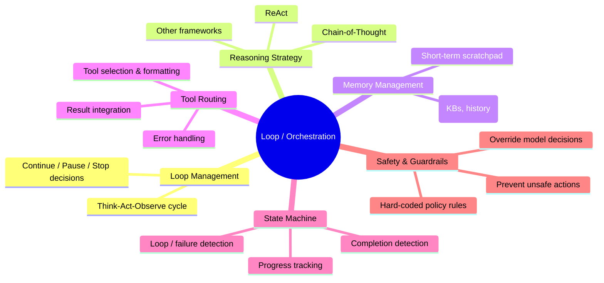
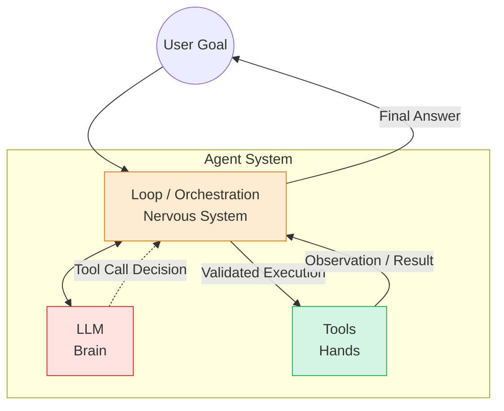

# Detailed Study Notes: Three Core Components of Every AI Agent

**Source:** Lecture Slides + Full Transcript  
**Topic:** AI Agent Architecture Fundamentals  
**Date:** June 27, 2026  
**Style:** Comprehensive, grounded explanations with tables and diagrams for study & reference

---

## Introduction & Overview

Every agent system — no matter how simple or complex — fundamentally reduces to **three core components**:

1. **LLM (Large Language Model)** — The Brain / Reasoning Engine
2. **Tools** — The Hands / Connection to the External World
3. **Loop (Orchestration)** — The Nervous System / Operating System

### Why These Three Matter

- The **LLM** provides intelligence and decision-making.
- **Tools** give the agent the ability to *act* in the real world (query databases, call APIs, execute code, read/write files, etc.).
- The **Loop** is the "secret sauce" — it orchestrates everything, manages state, memory, safety, and the cyclical reasoning process.

**Key Quote from Lesson:**  
> "Without tools, an LLM is just generating text. With tools, it becomes an actor in the real world."  
> "The loop is where real engineering complexity lives."

**Mental Models Provided:**
- LLM = Agent's **Brain**
- Tools = Agent's **Hands**
- Loop = Agent's **Nervous System** or **Operating System** (the conductor of the "agentic symphony")

The agent operates in a continuous **Think → Act → Observe** cycle until the goal is achieved or a stopping condition is met.

---

## 1. LLM — Agent's Brain (The Reasoning Engine)

The LLM sits at the center of decision-making. It can be **one or multiple models** of any size. The same LLM can power completely different agents simply by changing the available tools — **no retraining is required**.

### What the LLM Actually Does Inside an Agent

The LLM performs these critical functions in every iteration:

| Function | Detailed Explanation |
|----------|----------------------|
| **Understands User Intent** | Parses natural language queries to extract goals, constraints, and context. |
| **Plans Multi-Step Sequences** | Breaks down complex goals into logical, ordered steps. |
| **Decides Tool Usage** | Chooses which tool(s) to call and prepares the correct arguments/parameters. |
| **Interprets Tool Results** | Analyzes the output returned by tools and decides what to do next. |
| **Determines Next Action** | Decides whether to call another tool, respond to the user, or stop. |
| **Generates Final Response** | Produces the final, user-facing answer once the goal is complete. |

### Capabilities, Cost & Latency Tradeoffs

Selecting an LLM for agents is **not** simply "pick the model with the highest benchmark." It is a deliberate **trade-off problem** balancing three factors:

| Factor | What It Means | Why It Matters for Agents | Practical Implication |
|--------|---------------|---------------------------|-----------------------|
| **Instruction Following** | How reliably the model follows structured system prompts (role definition, tool schemas, output format). | Agents depend heavily on precise adherence to instructions. | Weak instruction following leads to malformed tool calls or ignored guardrails. |
| **Context Window Size** | Maximum tokens the model can process in one call. | Agents accumulate context rapidly (every thought, action, observation is appended). | Larger windows (128k–1M+ tokens) are strongly preferred for complex, long-running tasks. |
| **Reasoning Strength** | Quality of multi-step logical reasoning and planning. | Directly determines success on complex, multi-step goals. | Newer "reasoning models" have built-in Chain-of-Thought training from pre-training. |
| **Cost per Call** | Price of each LLM API invocation. | Every loop iteration typically costs 1+ LLM calls. | High-volume agents can become expensive quickly. |
| **Latency** | Time taken for each model response. | Affects user experience in interactive agents. | Two-tier architectures are common: fast/cheap model for simple routing + strong model for hard reasoning. |

**Two-Tier Pattern (Common Production Practice):**
- Use a **cheaper, faster model** for simple routing / classification decisions.
- Use a **more capable (and expensive) model** only when complex reasoning or planning is required.

**Important Modern Development:**
Newer reasoning models from OpenAI and Anthropic have **built-in Chain-of-Thought** capabilities through training. This can significantly improve agent reliability but usually comes with **higher cost and latency**.

**Core Takeaway:**  
The LLM is the **reasoning core**, but production agent design requires thoughtful selection based on the specific capability–cost–latency profile of the use case.

---

## 2. Tools — Agent's Hands (The Actuators)

Tools are what make agents powerful. They bridge the agent to the external world and transform a pure language model into a system capable of **real-world action**.

### What Tools Enable

- Real-time data access (databases, APIs, search)
- Real-world actions (sending emails, updating records, controlling devices)
- Code execution
- File operations
- RAG (Retrieval-Augmented Generation) pipelines
- Any custom capability you can wrap in a function

**Without tools** → LLM = sophisticated text generator.  
**With tools** → LLM becomes an **actor** that can read information and execute actions.

### The Tool-Calling / Function-Calling Flow (Step by Step)

This is one of the most important mechanisms in agent design. Here is the complete cycle:

```mermaid
flowchart LR
    subgraph Agent Application
        direction TB
        A1[Agent Code] 
    end

    subgraph LLM
        direction TB
        L1[LLM Brain]
    end

    A1 -->|1. Defines available tools<br/>as JSON schemas| L1
    User((User Query)) -->|2. Sends tools + query| L1
    L1 -->|3. Decides:<br/>Text answer OR<br/>Structured tool call| A1
    A1 -->|4. Validates &amp; Executes<br/>the actual tool<br/>(Security Boundary)| External[External Systems<br/>APIs / DBs / Code]
    External -->|5. Returns raw result| A1
    A1 -->|6. Sends result back<br/>as Observation| L1
    L1 -->|Loop continues until goal met| A1
```

### Detailed Walkthrough of Each Step

1. **Agent Defines Tools**  
   The developer creates structured definitions (usually JSON Schema) describing every tool the agent can use. Each definition includes name, description, parameters, and types.

2. **Agent Sends Tools + User Query to LLM**  
   The full list of tool schemas is injected into the prompt/context sent to the LLM along with the user's request. The LLM now "sees" both the question and the toolbox available to solve it.

3. **LLM Decides**  
   The LLM reasons and chooses one of two paths:
   - Generate a normal text response to the user, **or**
   - Emit a **structured tool call** (a special JSON object the application recognizes).

4. **Agent Executes the Tool (Critical Security Boundary)**  
   - The **LLM never executes any tool itself**.
   - It only *requests* a tool call in a structured format.
   - The agent application code is responsible for:
     - Validating the tool call request
     - Executing the real function (making the API call, running the code, querying the DB, etc.)
   - This separation is a **fundamental security boundary**. It prevents the model from directly performing actions on your systems.

5. **Agent Returns Results to LLM**  
   The output of the tool execution is packaged as an "observation" and sent back to the LLM. The LLM then incorporates this new information and decides the next action (call another tool, answer the user, or stop).

**Example from Lesson (Weather Query):**
User asks for temperature in Paris → LLM decides to call `get_weather(city="Paris")` → Agent executes the real weather API → Result returned to LLM → LLM generates final answer.

### Model Context Protocol (MCP)

MCP is a new standard introduced by Anthropic designed to create a **universal way** of defining tool interfaces across different LLM providers. It standardizes how LLMs connect to resources, prompts, and tools. A full module on MCP is part of this course series.

**Key Principle:**  
Tools turn language models from passive text generators into active, capable systems that can interact with the world.

---

## 3. Loop (Orchestration) — Agent's Nervous System

The **Loop** (also called the Orchestration Layer) is the component that ties everything together. It is the cyclical "thinking loop" that governs the agent's behavior over time.

**Best Mental Models:**
- Agent's **Nervous System**
- Agent's **Operating System**
- The **conductor** of the entire agentic symphony

It decides:
- When to continue reasoning
- When to pause or stop
- Which tool to call next
- How to handle failures
- When to apply safety overrides

This is where the majority of **real engineering complexity** in production agents lives.

### The Six Core Responsibilities of the Orchestration Layer

The loop manages six interconnected areas:



### Detailed Explanation of Each Responsibility

| Responsibility | What It Does | Why It Is Critical | Real-World Analogy |
|----------------|--------------|--------------------|--------------------|
| **Loop Management** | Runs the core Think–Act–Observe (or similar) cycle. Decides when to continue, pause, retry, escalate, or terminate based on progress and limits. | Prevents infinite loops and ensures the agent eventually produces an answer or stops gracefully. | Operating system process scheduler + watchdog timer |
| **Reasoning Strategy** | Applies structured prompting techniques (Chain-of-Thought, ReAct, Plan-and-Execute, etc.) to break large goals into smaller, manageable steps. | Raw LLMs can be inconsistent at complex planning. Structured strategies dramatically improve reliability. | Project manager breaking down a large initiative into sprints and tasks |
| **Memory Management** | Maintains short-term working memory (scratchpad for current session) and retrieves long-term context from conversation history, documents, or knowledge bases when needed. | Agents quickly lose coherence without memory. Long-running tasks require access to past observations and facts. | Human working memory + long-term memory + note-taking system |
| **Tool Routing** | Selects the most appropriate tool for the current step, formats valid requests, handles errors gracefully, and feeds results back into the reasoning context. | Bridges the gap between "I need information X" and "here is how to get X reliably." | Logistics coordinator who knows which vendor to call and how to interpret the delivery |
| **State Machine** | Tracks the agent's current position in its overall plan. Detects completion, repetition (looping), failures, and transitions between states. | Complex agents often follow multi-step plans. Without explicit state tracking, the agent can get lost or repeat work. | Workflow engine or finite state machine in traditional software |
| **Safety & Guardrails** | Enforces hard-coded policy rules that can **override** the LLM's decisions when necessary. | Even the best models can propose unsafe, expensive, or unauthorized actions. Guardrails provide deterministic protection. | Security guard or compliance officer who can veto decisions |

**Important Insight:**  
Guardrails are **outside** the model's control. They are deterministic code/rules that sit above the LLM and can intercept or block actions regardless of what the model "thinks" is best.

### How the Loop Functions as the Conductor

The orchestration layer is responsible for the overall flow:

1. Receive user goal
2. Initialize state and memory
3. Enter reasoning cycle (LLM thinks using chosen strategy)
4. Decide: tool call or final answer
5. If tool call → route to correct tool, execute safely, capture result
6. Feed observation back into context
7. Check state machine for completion / failure / loop conditions
8. Apply any safety guardrails
9. Either continue the loop or return final response to user

This cycle repeats until the goal is achieved or a stopping condition is triggered.

---

## How the Three Components Work Together (Integrated View)



**Flow Summary:**

- **User** gives a goal to the **Loop**.
- **Loop** manages memory/state and sends context + instructions to the **LLM**.
- **LLM** reasons and either:
  - Produces a final answer, or
  - Requests a tool call.
- **Loop** receives the decision, routes it through **Tool Routing**, and executes via **Tools** (respecting safety guardrails).
- **Tools** return results → **Loop** feeds them back to **LLM** as observations.
- Cycle continues until **Loop** determines the goal is complete or must stop.

---

## Summary Table: The Three Core Components at a Glance

| Component | Primary Role | Analogy | Key Outputs | Where Complexity Lives | Security Consideration |
|-----------|--------------|---------|-------------|------------------------|------------------------|
| **LLM** | Reasoning, planning, decision making, response generation | Brain | Thoughts, plans, tool-call requests, final answers | Prompt engineering + model selection | Must follow instructions reliably |
| **Tools** | Execute real-world actions and data access | Hands | Structured data, API responses, file changes, code results | Tool schema design + execution reliability | LLM never executes directly |
| **Loop** | Orchestration, state, memory, safety, flow control | Nervous System / OS | Controlled execution cycles, state transitions, final results | State machines, memory systems, guardrails, routing logic | Guardrails can override LLM decisions |

---

## Key Takeaways for Builders

1. **All agents = these three components** in different configurations and levels of sophistication.
2. **LLM alone is not an agent** — it is only the reasoning engine.
3. **Tools give agency** — they are what allow the system to affect the outside world.
4. **The Loop is where most production engineering happens** — state management, memory, reliability, safety, and control flow.
5. **Security boundary between LLM and tool execution** is non-negotiable.
6. **Tradeoffs are real** — capability, cost, and latency must be balanced when choosing models and designing loops.
7. **Guardrails are deterministic** — they sit above model reasoning and provide hard safety guarantees.
8. **MCP** is emerging as an important standardization layer for tools and context across providers.

---

**End of Notes**

*These notes are synthesized directly from the provided lecture slides and transcript. All explanations stay grounded in the source material while expanding each concept for deeper understanding and practical application.*

---

*File created as single comprehensive Markdown document per requirements.*
