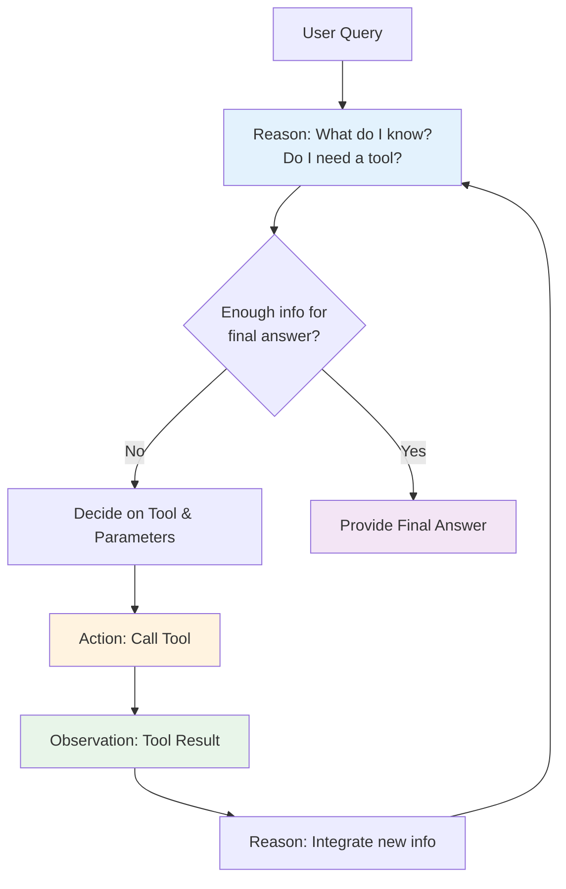

# Lesson 03: Reasoning Patterns
## Detailed Course Notes on How AI Agents Reason, Plan, and Decide

**Lesson Focus:**  
How agents reason, plan, and decide what to do next — including **ReAct**, **Chain-of-Thought (CoT)**, and **Tree-of-Thoughts (ToT)**.

These notes are compiled directly from the lesson slides, examples, and full transcript. All explanations stay grounded in the provided content. Tables and Mermaid diagrams are included for clarity where they enhance understanding.

---

## 1. Overview of Reasoning Patterns

AI agents need more than just a single prompt and response. They must:

- Break down complex problems
- Decide **when** and **how** to use tools
- Show their work for transparency and debugging
- Interact with the real world (via tools) instead of hallucinating

The lesson introduces **three major reasoning frameworks** that address these needs:

1. **Chain-of-Thought (CoT)** — Sequential step-by-step reasoning
2. **ReAct** — Reasoning interleaved with actions/tools
3. **Tree-of-Thoughts (ToT)** — Branching exploration of multiple possibilities

> **Key Lesson Insight:** Most production agents use **ReAct** because it best balances transparency, capability, and cost. Understanding all three helps you choose the right pattern for the right problem.

---

## 2. Major Reasoning Frameworks Comparison

| Framework | Full Form                  | Core Idea                                      | Best Suited For                          | Strengths                                      | Limitations                              |
|-----------|----------------------------|------------------------------------------------|------------------------------------------|------------------------------------------------|------------------------------------------|
| **CoT**   | Chain-of-Thought           | Breaks problem into sequential intermediate reasoning steps before final answer | Math, logic, step-by-step analysis      | Transparency, debuggability, improved accuracy on complex tasks | Only internal knowledge; no real-world actions or self-correction |
| **ReAct** | Reasoning + Acting         | Interleaves **Thought** (reasoning) with **Action** (tool use) and **Observation** in a loop | Tool selection, multi-step tasks, external API calls, real-world grounding | Transparent + grounded in reality; reduces hallucinations | Slightly higher latency due to tool calls |
| **ToT**   | Tree-of-Thoughts           | Explores multiple reasoning branches simultaneously (like a search tree). Each thought is evaluated before choosing a branch | Creative tasks, strategic planning, exploration, problems with many possible paths | Can discover better solutions by evaluating alternatives | Higher computational cost; more complex to implement |

**Lesson Takeaway on Choice:**
> In practice, most production agents use **ReAct** because it balances transparency, capability, and cost. Knowing all three lets you choose the right tool for the right problem.

---

## 3. Chain-of-Thought (CoT): Thinking Step by Step

### 3.1 The Core Idea

**CoT is not an agent pattern** — it is a **prompting technique** that makes LLMs reason better.

**Instead of** asking the model to jump directly to the answer, you instruct it to **think step by step**.

**Core Benefits (directly from lesson):**
- Dramatically improves accuracy on complex tasks (math, logic, multi-step reasoning, puzzles, structured analysis)
- **Transparency**: We can see *how* the answer was derived
- **Debuggability**: We can spot exactly where reasoning goes wrong
- Does **not** make the model smarter — it helps the model use its existing reasoning ability **more reliably**

### 3.2 Two Main Variants

| Variant            | Description                                                                 | Implementation                                      |
|--------------------|-----------------------------------------------------------------------------|-----------------------------------------------------|
| **Zero-Shot CoT**  | No examples given. Model is simply told to reason step by step.            | Add the phrase: **"Let's think step by step"** to the prompt |
| **Few-Shot CoT**   | Provide worked examples that demonstrate the full reasoning process.       | Include 1–3 examples in the prompt showing intermediate steps before the final answer |

### 3.3 Concrete Example: Math Reasoning (from Lesson Slides)

**Problem:**  
If a store has 15 apples and sells 3 batches of 4, how many are left?

#### Without Chain-of-Thought
- The model may directly output: **3**
- This answer might be correct by chance or pattern matching, but there is **no traceable reasoning**
- If the model is wrong, you cannot debug *why*

#### With Chain-of-Thought
The model produces a visible reasoning trace:

```
Let me work through this.
3 batches of 4 = 12.
15 - 12 = 3.
Answer: 3 (correct, with traceable reasoning)
```

**Mathematical representation (GitHub-flavored LaTeX):**

$$
3 \times 4 = 12
$$

$$
15 - 12 = 3
$$

**Final Answer:** 3

**Critical Lesson Point:**
> CoT does **not** change the final numeric answer in this case. The power lies in **traceable reasoning**. You can now audit, debug, and trust (or correct) the process.

### 3.4 Limitations of Standalone CoT (Especially for Agents)

From the dedicated slide "CoT limitations for Agents":

**Limitations of Standalone CoT:**
- Uses **only internal knowledge** — cannot look things up
- If the model's knowledge is wrong, it produces **confidently wrong** reasoning
- **Cannot self-correct** against external reality
- **Cannot take actions** in the real world

**Why This Matters for Agents:**
- CoT gives agents the ability to "**think**"
- But thinking alone is **not enough** — agents also need to **act** on the real world
- Solution: Combine CoT reasoning with tool use → **ReAct pattern**
- Note on modern models: Reasoning-tuned models (o1, R1, etc.) perform CoT **internally**. Some providers hide the thinking tokens or only return a short summary; others can expose thinking blocks.

---

## 4. ReAct: Reasoning + Acting in a Loop

### 4.1 What is ReAct?

**ReAct** = **Reasoning + Acting**

It is the **most important agent design pattern** taught in this lesson.

**Definition from transcript:**
> ReAct is Chain-of-Thought **plus** tool use **in a loop**.

It solves the core weakness of standalone CoT (no external access) and the weakness of pure tool-calling (no reasoning about when/how to use tools).

### 4.2 The ReAct Loop (Step-by-Step)

The agent repeatedly cycles through:

1. **Reason (Thought)**: Analyze current state and decide what to do next
2. **Act (Action)**: Call a tool (or decide no tool is needed)
3. **Observe (Observation)**: Receive the result from the tool or environment
4. **Repeat** the cycle with new information until ready to give a final answer

This **interleaved format** is the secret sauce. It prevents the model from making up answers when it should look things up.

### 4.3 ReAct Trace Example (Directly from Lesson)

**User Question:** Who directed Inception and what year?

**Full ReAct Trace:**

- **Reason:** I need to search for the director of Inception.
- **Action:** `search("Inception film director and year")`
- **Observation:** Christopher Nolan directed Inception (2010).
- **Reason (Again):** I now have both pieces of information.
- **Final Answer:** Inception was directed by Christopher Nolan, released in 2010.

### 4.4 Mermaid Diagram: ReAct Agent Loop



**How to read the diagram:**
- The loop (B → D → E → F → G → B) continues until the agent has enough information.
- The **Reason** step happens both before and after tool calls.
- This structure makes every decision **transparent and auditable**.

### 4.5 Why ReAct Works (Benefits from Lesson)

From the slide "Why ReAct Works":

- **Reasoning traces** make the agent's logic **transparent and debuggable**
- **External tool use** grounds reasoning in **real-world data**, dramatically reducing hallucinations
- The **interleaved format** prevents the model from "making up" answers when it should use a tool
- **Outperforms** both CoT-only and action-only approaches on QA and decision-making benchmarks
- This is the pattern implemented under the hood by major frameworks (LangChain, OpenAI Agents SDK, etc.)

### 4.6 How ReAct is Implemented in Practice

Typical system prompt for a ReAct agent (paraphrased from transcript):

> You have access to these tools.  
> Think step by step.  
> If you need information, use a tool.  
> When you are ready, provide the final answer.

The framework handles the loop mechanics; the LLM only generates the next **Thought**, **Action**, or **Final Answer**.

---

## 5. Tree-of-Thoughts (ToT)

### 5.1 Core Concept

**Tree-of-Thoughts** treats reasoning as a **search problem**.

Instead of following one linear chain (CoT) or one tool-using loop (ReAct), the agent:

- Generates **multiple possible thoughts** at each step
- Evaluates each branch
- Decides which branch(es) to explore further
- Backtracks if a path looks unpromising

**Analogy from lesson:**  
Like a chess player thinking: *"If I move here… versus if I move there…"* before committing to a move.

### 5.2 When to Use ToT

| Strength                          | Example Use Cases                     |
|-----------------------------------|---------------------------------------|
| Explores multiple strategies      | Creative writing, game strategy, complex planning |
| Can discover non-obvious solutions| Research, design, optimization problems |
| Good at self-evaluation           | Tasks where wrong paths are costly    |

**Trade-offs:**
- Significantly higher token usage and latency
- More complex prompting and orchestration
- Best reserved for high-value, open-ended problems

---

## 6. Summary Comparison & Decision Guide

| Dimension                    | CoT                              | ReAct                                      | ToT                                      |
|-----------------------------|----------------------------------|--------------------------------------------|------------------------------------------|
| **Reasoning Style**         | Linear chain                     | Interleaved Thought → Action → Observation | Branching tree search                    |
| **External Grounding**      | None                             | Excellent (tools)                          | Depends on tools + evaluation            |
| **Transparency**            | High                             | Very High                                  | High                                     |
| **Best Problem Type**       | Math, logic, structured analysis | Tool-heavy workflows, real-world QA        | Creative/strategic exploration           |
| **Computational Cost**      | Low                              | Medium                                     | High                                     |
| **Production Usage**        | Common for simple prompts        | **Most common in production agents**       | Niche / experimental                     |
| **Debuggability**           | Good                             | Excellent                                  | Good                                     |

**Lesson Recommendation (repeated for emphasis):**
> Most production agents use **ReAct** because it balances transparency, capability, and cost.

---

## 7. Key Takeaways (Memorize These)

1. **CoT** is a foundational prompting technique that makes LLMs show their work. It improves reliability on reasoning tasks but cannot access the real world.

2. **ReAct** = CoT + Tool Use in a Loop. It is the dominant pattern for building capable, grounded agents. The interleaved structure is what prevents hallucinations and enables real actions.

3. **ToT** adds branching exploration. Use it when the problem benefits from evaluating multiple possible reasoning paths.

4. **Transparency is a feature, not a bug.** All three patterns make agent behavior auditable and correctable — a major advantage over black-box prompting.

5. **Choose the pattern based on the problem:**
   - Pure internal reasoning task → CoT
   - Need to use tools or fetch real data → **ReAct**
   - Multiple competing strategies or creative exploration → ToT

6. Modern agent frameworks (LangChain, etc.) implement **ReAct** under the hood via carefully designed system prompts.

---

## 8. Notes from Full Lesson Transcript

- The instructor emphasizes that **ReAct** is what you saw in the previous lesson's flight-booking example (Reason → Action: call flight tool → Observation: flights returned → Reason again → Final Answer).
- Transparency in ReAct makes the agent's reasoning **auditable and correctable** — a key advantage for production systems.
- CoT alone is powerful for math/logic but insufficient for agents that must act.
- The lesson explicitly states that understanding these patterns helps you design better agents and debug their failures more effectively.
- Most real-world agent implementations hide the complexity behind a system prompt that tells the model: "Think step by step. Use tools when needed. Give final answer when ready."

---

**End of Lesson 03 Notes**

*These notes are self-contained and ready for study, revision, or implementation reference. All content is derived strictly from the lesson materials provided.*

---

**File created:** `/home/workdir/artifacts/Reasoning_Patterns_Detailed_Notes.md`
